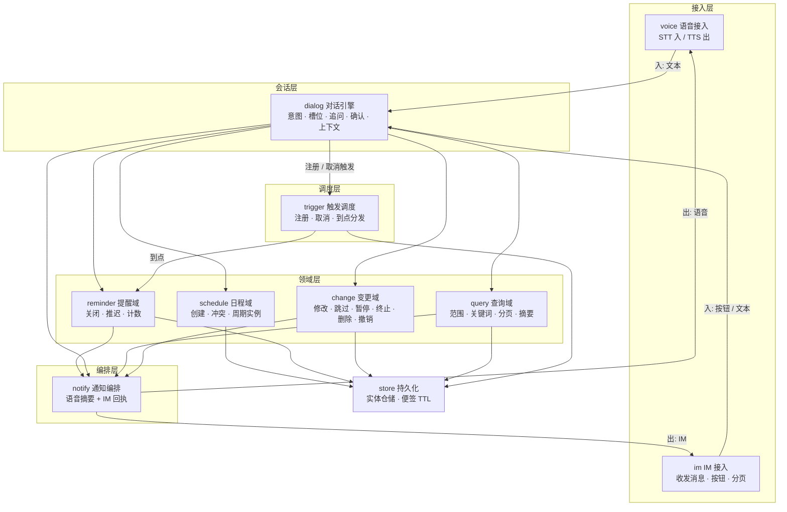
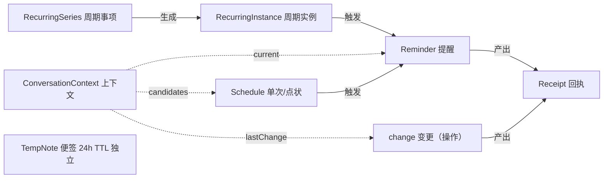
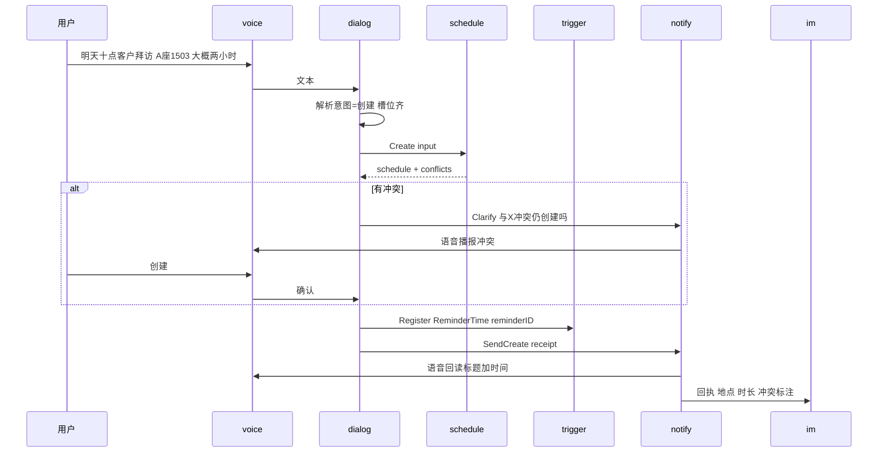
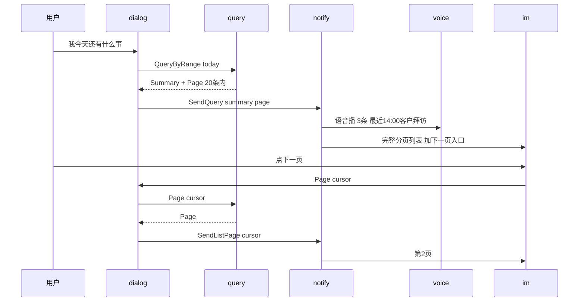
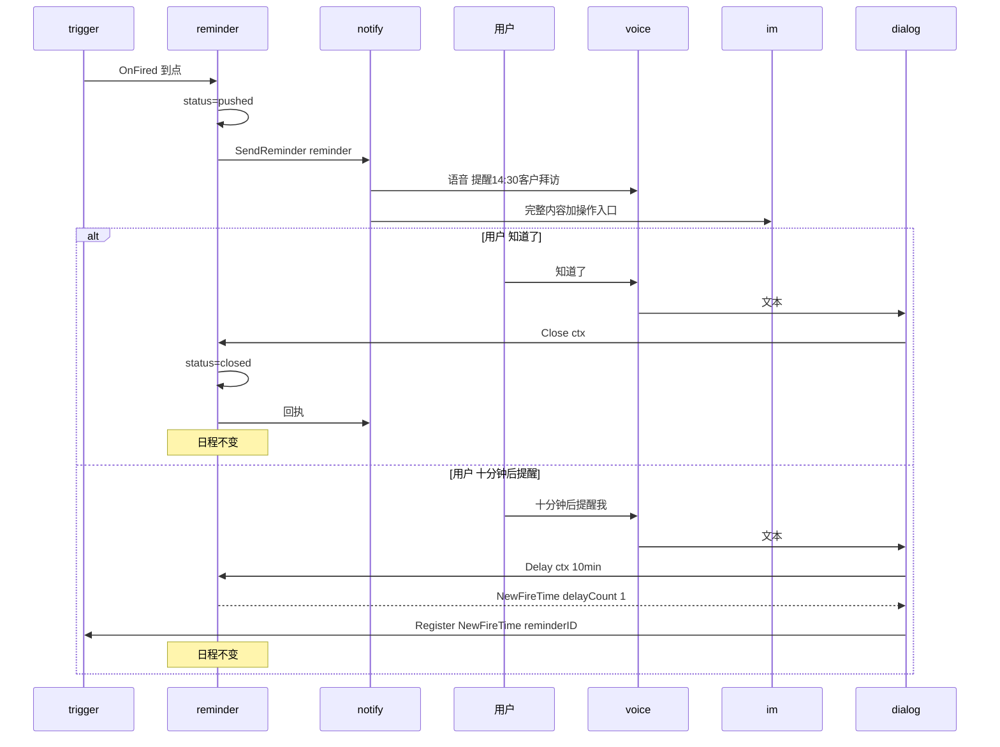
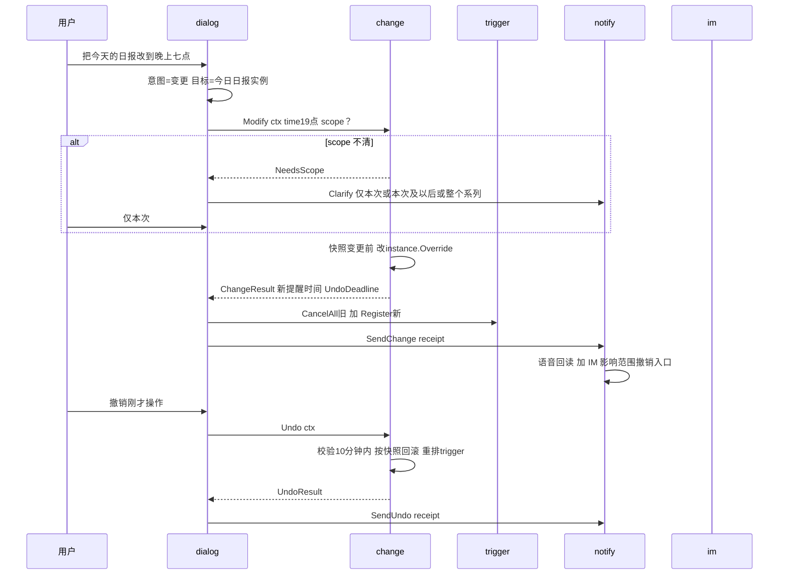

# 语音日程提醒工具 — 产品架构设计

> 角色：架构说明（辅助）。依据《架构设计规范》，系统架构以入库空骨架代码为主要载体；本文承载代码难以表达的内容：模块划分依据、整体协作逻辑、数据模型与接口契约。读完类目与接口可读懂业务逻辑。
> 承接：《语音日程提醒工具 MVP Proposal》（产品定稿）、《P2 提醒触发与即时响应》。
> 闭环：语音创建 / 查询 → 事件触发提醒 → 语音即时处理 → 日程变更 / 撤销。
> 范围：个人用户、语音 + IM 双通道、简单周期（每天 / 每周 / 每月）。Proposal「明确不做」全部不在本架构内。

## 一、需求梳理

从产品定稿的四项能力出发，归纳其技术本质与关键约束。这是模块拆分的输入。

| 能力 | 用户怎么说 | 技术本质 | 关键约束 |
| --- | --- | --- | --- |
| 创建 | “明天十点客户拜访，A 座 1503，大概两个小时” | 语音解析为结构化实体，补齐槽位，冲突检测后落库并排程触发 | 必填项缺则追问；冲突不阻断、由用户决定；点状 / 周期 / 便签规则不同 |
| 查询 | “我今天还有什么事” | 按时间范围 / 关键词聚合读，分页输出 | 语音只播摘要，完整列表走 IM，每页 ≤ 20 条 |
| 提醒处理 | “知道了” / “十分钟后提醒我” | 提醒状态机迁移，**不改日程** | 关闭 / 推迟二选一；推迟计数上限 3 次；多提醒歧义不默认关闭 |
| 日程变更 | “把今天的日报改到晚上七点” / “跳过” / “删掉” | 改动日程本体，高风险须确认 + 范围解析 + 10 分钟撤销 | 范围不清先问；删除 / 终止 / 跳过等同取消须确认；只改不动其他日程 |

四项能力叠加上述「明确不做」，决定了本系统的两条主线：

1. **提醒与日程分离**：提醒处理只迁移提醒状态，绝不触碰日程字段；改日程走变更域。这是最关键的架构缝。
2. **双通道分工**：语音负责即时短反馈与打断式操作，IM 负责完整回执、复杂候选与分页列表。通道独立、互不阻塞。

## 二、风险分析

先排除编码前的不确定性，避免风险遗留。每条风险对应负责模块与应对。

| 风险 | 影响 | 应对（落点模块） |
| --- | --- | --- |
| 意图边界模糊：“稍后提醒”(改提醒) 与“改到八点”(改日程) 听感相近 | 误把改日程当推迟，或反之 | dialog 由意图分类先判 P2/P3 边界，变更一律路由到 change |
| 周期范围歧义：“改到晚上七点”未说仅本次还是整系列 | 误改未来所有实例，恰是用户最怕的误改 | change 在执行前强制 scope 解析（仅本次 / 本次及以后 / 整个系列），不清不执行 |
| 多提醒同时到达，“知道了”目标不清 | 关错提醒 | reminder 队列化，dialog 先列候选让用户选，不默认关闭任何一条 |
| 推迟计数与上限 | 超过 3 次仍创建新稍后提醒，提醒无限循环 | reminder 维护 delayCount，第 3 次标记末次，之后只允许关闭或改日程 |
| 冲突边界条件 | 首尾相接被判冲突、点落入时段漏判 | schedule 精确实现重叠规则（见 §7），不依赖模糊时段比较 |
| 10 分钟撤销一致性 | 只回滚日程字段，漏掉已注册 / 已取消的触发与提醒 | change 在变更前快照（含 reminder / trigger 状态），撤销整体回滚并重排触发 |
| 双通道部分送达 | 语音成功 IM 失败时用户以为没记，或反之困惑 | notify 两通道独立发送，互不阻塞，失败侧记录重试 |
| 临时便签不过期 | 24h 后仍可查，扩成长期记忆库 | store 对便签设 TTL，到期自动失效且不进查询索引 |

## 三、模块拆分

系统架构分接入、会话、领域、调度、编排五层加持久化，共九个模块。模块职责清晰，相互依赖成有向无环图，无环。



| 模块 | 层 | 职责 | 关键不下沉 |
| --- | --- | --- | --- |
| voice | 接入 | 音频转文本入、文本转语音出；不感知业务 | 不做意图解析、不做回执拼装 |
| im | 接入 | 发消息 / 回执 / 分页 / 按钮，收用户点击与文本 | 不做日历查询入口、不做开放式闲聊 |
| dialog | 会话 | 解析意图与槽位、补全 / 追问 / 确认、维护上下文、产出 Command 并编排领域调用 | 不持有日程字段、不改提醒状态本身 |
| schedule | 领域 | 单次 / 点状 / 周期 / 便签的实体生命周期、冲突检测、周期实例生成 | 不做关闭 / 推迟、不做变更 |
| reminder | 领域 | 提醒状态机、关闭、推迟、推迟计数与上限、多提醒排队 | 不改日程字段 |
| change | 领域 | 修改 / 跳过 / 暂停 / 终止 / 删除的安全流程、范围解析、10 分钟撤销 | 不做创建、不做纯提醒处理 |
| query | 领域 | 时间范围 / 关键词 / 下一条查询、分页、摘要生成 | 不改任何状态 |
| trigger | 调度 | 注册 / 取消时间触发，到点按时间序分发到 reminder | 不持有业务语义 |
| notify | 编排 | 把领域结果拆为「语音摘要 + IM 完整」，两通道独立不阻塞 | 不做语义判断、不做日历查询 |
| store | 持久化 | 实体仓储、临时便签 TTL | 不含领域规则 |

### 划分依据

- **按四项能力切领域**：schedule(创建)、query(查询)、reminder(提醒处理)、change(变更) 一一对应，边界即产品能力边界。
- **提醒与变更分家**：产品反复强调「提醒处理不改日程」。把只改提醒状态的 reminder 与改日程本体的 change 拆开，是从根上保证这条约束：reminder 的接口签名里压根没有日程字段。
- **trigger 独立**：时间触发是跨能力的公共能力（创建排程、推迟再触发、变更重排都要用），独立成调度层，避免领域模块互相调用造成环。
- **notify 收口双通道策略**：语音播什么、IM 发什么、是否互相阻塞，是产品核心决策，集中一处实现。若散在各领域，策略会分裂。
- **dialog 当编排入口**：语音 / IM 输入都先到 dialog，由它产出 Command 并协调领域 + trigger + notify。领域模块保持只依赖 store，trigger / notify 只由 dialog 与 reminder / query / change 调用，依赖无环。

## 四、数据模型

### 基础业务单元

产品「基本概念」映射为实体（数据）与行为（操作 / 状态）。这是读懂业务逻辑的最小集合。

| 概念 | 性质 | 落点 |
| --- | --- | --- |
| 单次日程 | 实体（事件型） | Schedule，kind = event，有结束时间 |
| 点状提醒 | 实体（点型） | Schedule，kind = point，无结束时间 |
| 周期事项 | 实体（系列） | RecurringSeries，定义规则与模式 |
| 周期实例 | 实体（衍生） | RecurringInstance，由 series 在某日生成的一次 |
| 临时便签 | 实体（短期） | TempNote，24h TTL，无提醒、不进查询索引 |
| 提醒 | 实体 + 状态机 | Reminder，由 schedule / 实例创建，reminder 模块管迁移 |
| 弱提醒 | 提醒的来源种类 | Reminder.source = soft，不要求处理 |
| 跳过 | 操作 | change.Skip，置某 instance 为 skipped |
| 暂停 | 操作 + 状态 | change.Pause，series.status = paused + pausedUntil |
| 终止 | 操作 | change.Terminate，series.status = terminated（高风险） |
| 操作回执 | 实体（记录） | Receipt，create / reminder / change / undo 后生成 |
| 对话上下文 | 实体（会话态） | ConversationContext，解析“这个”“刚才那条” |

### 实体定义

**Schedule（单次日程 / 点状提醒）**

| 字段 | 类型 | 说明 |
| --- | --- | --- |
| ID | string | 唯一标识 |
| Kind | `event` / `point` | event 占用时间段，point 仅触发时间 |
| Title | string | 标题 |
| StartTime | time | event 为发生时间，point 为触发时间 |
| EndTime | time | event 必填，point 为空 |
| Location | string | 地点 |
| Notes | string | 备注 |
| ReminderTime | time | 主提醒时间 |
| HasSoftReminder | bool | event 且有明确开始时间：开始前 15 分钟弱提醒 |
| Conflict | bool | 创建时与现有冲突且用户选择并存 |
| CreatedAt | time | |

**RecurringSeries（周期事项）**

| 字段 | 类型 | 说明 |
| --- | --- | --- |
| ID | string | |
| Kind | `event` / `point` | |
| Title | string | |
| Rule | `daily` / `weekly` / `monthly` | 本期仅此三类 |
| TimePattern | 时间点 + 星期 / 日期 | 每个实例的发生 / 触发时间模式 |
| Duration | duration | event 类持续时长 |
| Location / Notes | string | 每实例继承 |
| ReminderPattern | 每实例主提醒时间设置 | |
| HasSoftReminder | bool | |
| Status | `active` / `paused` / `terminated` | |
| PausedUntil | time | 仅 paused 时有效，到期恢复 |

**RecurringInstance（周期实例）**

| 字段 | 类型 | 说明 |
| --- | --- | --- |
| ID | string | |
| SeriesID | string | 归属的 series |
| Date | date | 本实例所在日 |
| StartTime | time | |
| EndTime | time | event 类 |
| Status | `active` / `skipped` / `modified` | skipped = 被跳过；modified = 被仅本次改过 |
| Override | 字段集 | modified 时覆盖 series 的对应字段 |

**TempNote（临时便签）**

| 字段 | 类型 | 说明 |
| --- | --- | --- |
| ID | string | |
| Content | string | |
| CreatedAt | time | |
| ExpiresAt | time | = CreatedAt + 24h，过期自动失效且不可查 |

**Reminder（提醒）**

| 字段 | 类型 | 说明 |
| --- | --- | --- |
| ID | string | |
| SourceID | string | Schedule.ID 或 RecurringInstance.ID |
| SourceType | `schedule` / `instance` | |
| Title | string | 播报用 |
| TriggerTime | time | 本条触发时间 |
| Source | `main` / `soft` / `snooze` | 主提醒 / 弱提醒 / 稍后提醒 |
| Status | `pending` / `pushed` / `closed` / `delayed` / `multi-delayed` | |
| DelayCount | int | 推迟次数 |
| EverDelayed | bool | 是否曾推迟，播报“这是之前推迟过的提醒” |

**Receipt（操作回执）**

| 字段 | 类型 | 说明 |
| --- | --- | --- |
| ID | string | |
| Type | `create` / `reminder` / `change` / `undo` | |
| RawUtterance | string | 用户原话 |
| Target | string | 操作对象 |
| Before | snapshot | 变更前内容 |
| After | snapshot | 变更后内容 |
| Scope | string | 影响范围（仅本次 / 本次及以后 / 整个系列） |
| Result | string | 操作结果 |
| UndoDeadline | time | change 类的撤销截止时间 |
| Timestamp | time | |

**ConversationContext（对话上下文）**

| 字段 | 类型 | 说明 |
| --- | --- | --- |
| SessionID | string | |
| CurrentReminderID | string | 当前提醒，解析“知道了”目标 |
| CandidateIDs | []string | 候选日程 / 提醒，解析“这个”“刚才那条” |
| LastChangeID | string | 最近一次变更，供撤销 |
| LastChangeAt | time | |
| Pending | 槽位 / 确认 | 待补全或待确认的项 |

**Trigger（触发，调度内部）**

| 字段 | 类型 | 说明 |
| --- | --- | --- |
| ID | string | |
| FireTime | time | |
| ReminderID | string | |
| Status | `scheduled` / `fired` / `cancelled` | |

### 实体关系



核心关系：series 生成 instance；schedule 与 instance 各自触发 reminder；reminder 的响应与 change 的执行都产出 receipt；context 用虚线引用当前提醒、候选列表与最近变更，仅用于消歧与撤销，不构成强拥有。临时便签独立，只受 TTL 约束。

## 五、模块接口契约

契约以 Go interface 表达，方法签名即业务语义。模块内部实现留空或桩（数据可 mock），串联真实。读接口即可读懂各模块做什么、边界在哪。

```go
// pkg schedule —— 日程域：实体生命周期、创建、冲突检测、周期实例生成
type CreateInput struct {
    Kind         Kind        // event | point
    Title        string
    StartTime    time.Time
    EndTime      *time.Time  // event 必填；point 为空
    Duration     *time.Duration
    Location     string
    Notes        string
    ReminderTime time.Time   // 主提醒时间
    SoftReminder bool        // event 且有明确开始时间才有
    Recurring    *RecurringInput // 非空则创建周期事项
}

type Conflict struct {
    WithID  ID
    Overlap string
}

// Create 创建单次日程 / 点状提醒 / 周期事项。
// 返回创建结果与检测到的冲突；冲突不阻断创建，由调用方（dialog）转交用户决定。
func (s *Service) Create(in CreateInput) (sched *Schedule, conflicts []Conflict, err error)

// CreateTempNote 创建 24h 临时便签：无提醒、不进查询索引、到期自动失效。
func (s *Service) CreateTempNote(content string, now time.Time) (note *TempNote, err error)

// DetectConflict 检测候选时段与现有日程的冲突。
// 规则：两事件时段重叠=冲突；首尾相接(A.end==B.start)不冲突；
// 点落入某事件时段=冲突；两点同时间=冲突。
func (s *Service) DetectConflict(cand Candidate) ([]Conflict, error)

// GenerateInstances 按 series 规则在 [from, to] 生成实例（lazy，到查询或提醒窗口才展开）。
func (s *Service) GenerateInstances(seriesID ID, from, to time.Time) ([]RecurringInstance, error)

// ListSchedules 供 query 域读取。filter 含时间范围 / 关键词。
func (s *Service) ListSchedules(f ScheduleFilter) ([]Schedule, error)
```

```go
// pkg reminder —— 提醒域：提醒状态机、关闭、推迟、推迟计数与上限。
// 接口签名不含任何日程字段——提醒处理绝不触碰日程，这是本域的硬边界。

// OnFired 由 trigger 在到点时调用：置 pushed，通过 notify 推语音 + IM（互不阻塞）。
func (r *Service) OnFired(reminderID ID) error

// Close 关闭当前提醒，底层日程不变。
// 目标不唯一时返回候选（NeedsChoose），不默认关闭任何一条。
func (r *Service) Close(ctx Context) (res CloseResult, err error)

// Delay 推迟当前提醒 duration 后再触发。
//   - duration 为空 → 返回 NeedsDuration，由调用方追问“多久后再提醒？”
//   - 有预设默认推迟时长 → 直接使用
//   - delayCount++；第 3 次返回 LastDelay（“这是本次最后一次稍后提醒”）
//   - 已达 3 次再推迟 → 返回 MustCloseOrChange，不再新建 snooze
//   - 返回 NewFireTime，由调用方（dialog）注册到 trigger
func (r *Service) Delay(ctx Context, duration *time.Duration) (res DelayResult, err error)

// ListActive 返回当前已推送、待响应的提醒，供多提醒歧义时列候选。
func (r *Service) ListActive() ([]Reminder, error)
```

```go
// pkg change —— 变更域：修改/跳过/暂停/终止/删除 + 范围解析 + 安全确认 + 10 分钟撤销。
// 所有方法返回 ChangeResult（含变更前/后快照、新提醒时间、UndoDeadline），
// 调用方据此重排 trigger 并经 notify 出回执。

type Scope int
const (
    ScopeThisOnly Scope = iota // 仅本次
    ScopeThisAndFuture         // 本次及以后
    ScopeAll                   // 整个系列
)

// Modify 修改日程字段。recurring 需 Scope；不清时返回 NeedsScope，不执行。
func (c *Service) Modify(ctx Context, fields Fields, scope *Scope) (ChangeResult, error)

// Skip 跳过某次周期实例（置 instance=skipped）；单次事项“跳过”等同取消，返回 NeedsConfirm。
// 重复跳过同一实例只回“本次已经跳过”，不重复生成变更。
func (c *Service) Skip(ctx Context, scope *Scope) (ChangeResult, error)

// Pause 在 until 前停止周期提醒，到期恢复（series.status=paused）。
func (c *Service) Pause(ctx Context, until time.Time) (ChangeResult, error)

// Terminate 停止周期事项后续提醒（series.status=terminated）。高风险，返回 NeedsConfirm。
func (c *Service) Terminate(ctx Context) (ChangeResult, error)

// Delete 删除单次日程或整个周期系列。高风险，返回 NeedsConfirm。
func (c *Service) Delete(ctx Context) (ChangeResult, error)

// Undo 10 分钟内撤销最近一次变更，按快照整体回滚（含 reminder / trigger），并重排触发。
// 超窗口返回 Expired。
func (c *Service) Undo(ctx Context) (UndoResult, error)
```

```go
// pkg query —— 查询域：时间范围 / 关键词 / 下一条 + 分页(≤20) + 摘要。
// 语音只播摘要（数量、最近一条、必要提醒），完整列表走 IM 分页。

func (q *Service) QueryByRange(r Range) (Summary, Page, error)
func (q *Service) QueryByKeyword(kw string) (Summary, Page, error)
func (q *Service) Next(now time.Time) (*Schedule, error)
func (q *Service) Page(cursor Cursor) (Page, error) // 下一页，超 20 条提供入口
```

```go
// pkg trigger —— 触发调度：注册/取消时间触发，到点按时间序分发。

func (t *Scheduler) Register(fireAt time.Time, reminderID ID) (triggerID ID, err error)
func (t *Scheduler) Cancel(reminderID ID) error
func (t *Scheduler) CancelAll(sourceID ID) error // 取消某日程/实例的全部触发
func (t *Scheduler) Run()                        // 扫描到期触发，按 FireTime 排序，逐条回调 reminder.OnFired
```

```go
// pkg notify —— 通知编排：把领域结果拆为"语音摘要 + IM 完整"，两通道独立不阻塞。
//   语音：标题 + 时间（提醒）/ 数量 + 最近一条（查询）
//   IM：地点、备注、完整内容、分页列表、撤销入口、冲突标注

func (n *Service) SendCreate(r Receipt) error      // 语音回读标题时间，IM 放地点时长冲突
func (n *Service) SendReminder(rm Reminder) error  // 语音播标题时间，IM 放完整内容
func (n *Service) SendQuery(sm Summary, p Page) error // 语音摘要，IM 发分页列表
func (n *Service) SendListPage(cursor Cursor) error   // IM 翻页
func (n *Service) SendChange(r Receipt) error       // 语音回读，IM 放影响范围与撤销入口
func (n *Service) SendUndo(r Receipt) error
```

```go
// pkg dialog —— 对话引擎：解析意图与槽位，补全/追问/确认，维护上下文，产出 Command 并编排领域调用。
// 意图边界：关闭/稍后 = 提醒处理 → reminder；改时间/跳过/暂停/终止/删除/撤销 = 变更 → change。

type DialogResult struct {
    Kind     ResultKind // Execute | Clarify | Confirm
    Cmd      Command    // Execute/Confirm 时携带
    Question string     // Clarify 时的追问
}

func (d *Engine) HandleUtterance(text string, ctx Context) (DialogResult, error)

// ResolveContext 解析"这个""刚才那条""上次操作"，用 ConversationContext 的候选 / lastChange 填充 Cmd 目标。
func (d *Engine) ResolveContext(ctx *Context, mentions []string) error
```

```go
// pkg store —— 持久化：实体仓储；临时便签 TTL（24h 自动失效、过期不可查、不进跨天模糊检索）。
// 各领域模块通过 Repo 接口依赖 store，不直连具体存储实现。
```

## 六、核心协作流程

### 6.1 语音创建（含冲突与追问）



### 6.2 语音查询与分页



### 6.3 提醒触发与即时处理



### 6.4 日程变更与撤销



## 七、详细设计（重点与难点）

**冲突检测规则**（schedule）。两候选 a、b：

- 事件 vs 事件：`a.start < b.end && b.start < a.end` 为冲突；`a.end == b.start` 首尾相接不裁定冲突。
- 点 vs 事件：点 `p.start` 落入 `[e.start, e.end)` 为冲突。
- 点 vs 点：`p.start == q.start` 为冲突。

冲突不阻断创建：返回冲突对象，由 dialog 转交用户。用户拒绝 → 不留下日程、提醒或回执；用户确认 → 保留两条并 `Conflict=true`，IM 标注。

**周期范围解析**（change）。

- 仅本次：在 RecurringInstance 上设 Override，series 规则不动；reminder 随实例新时间重建。
- 本次及以后：在当前点拆分 series——点之前保留原 series，点及之后新建应用新值的 series，原 series 的 Status 归于已完成段。
- 整个系列：改 series 规则，清除既有的实例 Override。

scope 缺失一律返回 NeedsScope，不执行；跳过 / 暂停 / 终止也走同一套范围语义。

**推迟状态机**（reminder）。

`pending →(触发) pushed → closed`；`pushed →(Delay) delayed →(再触发) pushed → …`。delayCount 随每次 Delay 递增：=3 时返回 LastDelay 并明确“本次最后一次稍后提醒”；第 3 次后再次到点若用户仍要推迟，返回 MustCloseOrChange，不再生成 snooze，只允许关闭或改日程。多提醒同时到达：reminder 按时间序入队，Close 目标不唯一时返回 ListActive 候选，dialog 列标题让用户选，不默认关闭。

**10 分钟撤销一致性**（change）。每次变更执行前对涉及的 schedule / instance / reminder / trigger 做整体快照存入 Receipt；Undo 在窗口内按快照回滚并重排触发（取消新触发、重建旧触发），超出窗口返回 Expired。撤销本身也发 IM 回执。

**双通道不阻塞**（notify）。语音与 IM 各自独立发送，任一失败不阻塞另一方；失败侧记录并重试。语音默认只播标题 + 时间，用户说“详细说说”再补播地点备注；完整内容、分页列表、撤销入口、冲突标注一律走 IM。

**临时便签 TTL**（store）。expiresAt = createdAt + 24h；到期自动失效、不可查询、不进跨天模糊检索、无提醒。这是它区别于长期记忆库的硬边界。

## 八、演进跟踪

MS1 闭环跑通后，每轮复盘记录相对上轮的架构变更。本期定稿即下列主干，预期后续在其上叠加、不推翻：

- 九模块主干 + reminder/change 分家；
- 实体七类 + Receipt / Context / Trigger；
- 触发、双通道、撤销、便签 TTL 四项机制定位不变。

后续若出现「频繁大改」或「功能难交付」，分别对应主干未定准 / 不足以支撑迭代，须此时复盘调整。
