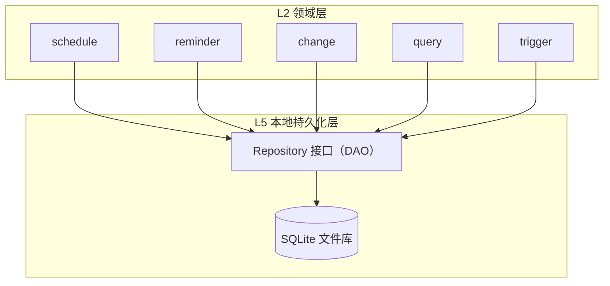
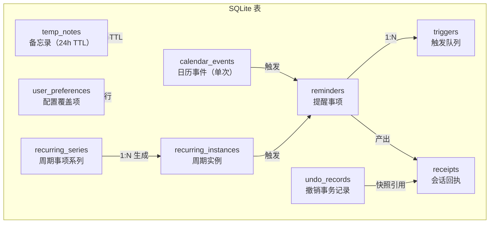

# L5 本地持久化层 — Entity 与 Repository 接口

> 承接《03-产品架构设计》store 模块与数据模型。L5 是数据的归宿：所有领域实体在此落盘，领域层通过 Repository 接口读写，不直连 SQLite。
> 存储：SQLite 单文件数据库，随 App 本地部署，单用户单库。
> 六张表对应产品数据图的六类：日历事件、提醒事项、配置覆盖项、备忘录、撤销事务记录、会话回执。

## 一、层级定位

L5 向上只暴露 Repository 接口，不暴露 SQL 与表结构。L2 领域模块（schedule / reminder / change / query / trigger）通过组合多个 Repository 完成业务，每个 Repository 对应一张表或一组密切关联的表。



**约束**：领域模块只调 Repository，不拼 SQL；Repository 只做 CRUD 与简单查询，不含业务规则（冲突检测、推迟计数、范围解析等留在领域层）。

## 二、数据库概览

六张表 + 一张触发队列表（提醒事项的调度索引），共七张物理表，映射架构文档的七类实体。



| 物理表 | 对应实体 | 产品数据图分类 |
| --- | --- | --- |
| `calendar_events` | Schedule | 日历事件 |
| `recurring_series` | RecurringSeries | 日历事件 |
| `recurring_instances` | RecurringInstance | 日历事件 |
| `reminders` | Reminder | 提醒事项 |
| `triggers` | Trigger | 提醒事项（调度索引） |
| `temp_notes` | TempNote | 备忘录 |
| `user_preferences` | UserPreference | 配置覆盖项 |
| `receipts` | Receipt | 会话回执 |
| `undo_records` | 变更快照 | 撤销事务记录 |

对话上下文（ConversationContext）不落盘——它是会话态，App 运行期驻留内存，重启即重置。

## 三、Entity 定义

每个 Entity 用 Go struct 表达字段约束，附建表 SQL。时间统一存 ISO 8601 字符串（SQLite 无原生 datetime），JSON 字段以 TEXT 存储。

### 3.1 日历事件 — calendar_events / recurring_series / recurring_instances

单次日程和周期事项分三张表：单次落 `calendar_events`，周期系列落 `recurring_series`，每次实例落 `recurring_instances`。

```go
// calendar_events：单次日程（event）或点状提醒（point）
type CalendarEventEntity struct {
    ID             string `db:"id"`               // TEXT PK
    Kind           string `db:"kind"`             // 'event' | 'point'
    Title          string `db:"title"`            // TEXT NOT NULL
    StartTime      string `db:"start_time"`       // TEXT NOT NULL (ISO 8601)
    EndTime        string `db:"end_time"`         // TEXT，event 必填，point 为 NULL
    Location       string `db:"location"`         // TEXT，可空
    Notes          string `db:"notes"`            // TEXT，可空
    ReminderTime   string `db:"reminder_time"`    // TEXT NOT NULL
    HasSoftReminder bool  `db:"has_soft_reminder"`// INTEGER 0/1
    Conflict       bool   `db:"conflict"`         // INTEGER 0/1
    CreatedAt      string `db:"created_at"`       // TEXT NOT NULL
}
```

```sql
CREATE TABLE calendar_events (
    id               TEXT PRIMARY KEY,
    kind             TEXT NOT NULL CHECK(kind IN ('event','point')),
    title            TEXT NOT NULL,
    start_time       TEXT NOT NULL,
    end_time         TEXT,
    location         TEXT,
    notes            TEXT,
    reminder_time    TEXT NOT NULL,
    has_soft_reminder INTEGER NOT NULL DEFAULT 0,
    conflict         INTEGER NOT NULL DEFAULT 0,
    created_at       TEXT NOT NULL
);
CREATE INDEX idx_cal_start ON calendar_events(start_time);
CREATE INDEX idx_cal_reminder ON calendar_events(reminder_time);
```

```go
// recurring_series：周期事项的定义与规则
type RecurringSeriesEntity struct {
    ID              string `db:"id"`
    Kind            string `db:"kind"`               // 'event' | 'point'
    Title           string `db:"title"`
    Rule            string `db:"rule"`               // 'daily' | 'weekly' | 'monthly'
    TimePattern     string `db:"time_pattern"`       // TEXT(JSON): 时间点 + 星期/日期模式
    DurationSec     int    `db:"duration_sec"`       // INTEGER，event 类秒数，point 为 0
    Location        string `db:"location"`
    Notes           string `db:"notes"`
    ReminderPattern string `db:"reminder_pattern"`   // TEXT(JSON): 每实例主提醒时间设置
    HasSoftReminder bool   `db:"has_soft_reminder"`
    Status          string `db:"status"`             // 'active' | 'paused' | 'terminated'
    PausedUntil     string `db:"paused_until"`       // TEXT，仅 paused 时非空
    CreatedAt       string `db:"created_at"`
}
```

```sql
CREATE TABLE recurring_series (
    id               TEXT PRIMARY KEY,
    kind             TEXT NOT NULL CHECK(kind IN ('event','point')),
    title            TEXT NOT NULL,
    rule             TEXT NOT NULL CHECK(rule IN ('daily','weekly','monthly')),
    time_pattern     TEXT NOT NULL,
    duration_sec     INTEGER NOT NULL DEFAULT 0,
    location         TEXT,
    notes            TEXT,
    reminder_pattern TEXT NOT NULL,
    has_soft_reminder INTEGER NOT NULL DEFAULT 0,
    status           TEXT NOT NULL DEFAULT 'active' CHECK(status IN ('active','paused','terminated')),
    paused_until     TEXT,
    created_at       TEXT NOT NULL
);
CREATE INDEX idx_series_status ON recurring_series(status);
```

```go
// recurring_instances：周期事项在某日生成的一次实例
type RecurringInstanceEntity struct {
    ID        string `db:"id"`
    SeriesID  string `db:"series_id"`   // TEXT FK -> recurring_series.id
    Date      string `db:"date"`        // TEXT 'YYYY-MM-DD'
    StartTime string `db:"start_time"`  // TEXT NOT NULL
    EndTime   string `db:"end_time"`    // TEXT，event 类有值
    Status    string `db:"status"`      // 'active' | 'skipped' | 'modified'
    Override  string `db:"override"`    // TEXT(JSON)，modified 时覆盖 series 字段
    CreatedAt string `db:"created_at"`
}
```

```sql
CREATE TABLE recurring_instances (
    id         TEXT PRIMARY KEY,
    series_id  TEXT NOT NULL REFERENCES recurring_series(id) ON DELETE CASCADE,
    date       TEXT NOT NULL,
    start_time TEXT NOT NULL,
    end_time   TEXT,
    status     TEXT NOT NULL DEFAULT 'active' CHECK(status IN ('active','skipped','modified')),
    override   TEXT,
    created_at TEXT NOT NULL
);
CREATE INDEX idx_inst_series ON recurring_instances(series_id);
CREATE INDEX idx_inst_date ON recurring_instances(date);
CREATE INDEX idx_inst_start ON recurring_instances(start_time);
```

### 3.2 提醒事项 — reminders / triggers

`reminders` 存提醒实体与状态机，`triggers` 是调度索引：trigger.Run 按 fire_time 扫描到期行，回调 reminder.OnFired。两表分离使扫描到期不触碰提醒全量字段。

```go
type ReminderEntity struct {
    ID          string `db:"id"`
    SourceID    string `db:"source_id"`    // calendar_events.id 或 recurring_instances.id
    SourceType  string `db:"source_type"`  // 'schedule' | 'instance'
    Title       string `db:"title"`
    TriggerTime string `db:"trigger_time"` // 本条触发时间
    Source      string `db:"source"`       // 'main' | 'soft' | 'snooze'
    Status      string `db:"status"`       // 'pending'|'pushed'|'closed'|'delayed'|'multi-delayed'
    DelayCount  int    `db:"delay_count"`
    EverDelayed bool   `db:"ever_delayed"`
    CreatedAt   string `db:"created_at"`
}
```

```sql
CREATE TABLE reminders (
    id           TEXT PRIMARY KEY,
    source_id    TEXT NOT NULL,
    source_type  TEXT NOT NULL CHECK(source_type IN ('schedule','instance')),
    title        TEXT NOT NULL,
    trigger_time TEXT NOT NULL,
    source       TEXT NOT NULL CHECK(source IN ('main','soft','snooze')),
    status       TEXT NOT NULL DEFAULT 'pending'
                   CHECK(status IN ('pending','pushed','closed','delayed','multi-delayed')),
    delay_count  INTEGER NOT NULL DEFAULT 0,
    ever_delayed INTEGER NOT NULL DEFAULT 0,
    created_at   TEXT NOT NULL
);
CREATE INDEX idx_rem_status ON reminders(status);
CREATE INDEX idx_rem_source_id ON reminders(source_id);
```

```go
type TriggerEntity struct {
    ID         string `db:"id"`
    FireTime   string `db:"fire_time"`  // 到点时间
    ReminderID string `db:"reminder_id"`// FK -> reminders.id
    Status     string `db:"status"`     // 'scheduled' | 'fired' | 'cancelled'
    CreatedAt  string `db:"created_at"`
}
```

```sql
CREATE TABLE triggers (
    id          TEXT PRIMARY KEY,
    fire_time   TEXT NOT NULL,
    reminder_id TEXT NOT NULL REFERENCES reminders(id) ON DELETE CASCADE,
    status      TEXT NOT NULL DEFAULT 'scheduled'
                  CHECK(status IN ('scheduled','fired','cancelled')),
    created_at  TEXT NOT NULL
);
CREATE INDEX idx_trig_fire ON triggers(fire_time);
CREATE INDEX idx_trig_reminder ON triggers(reminder_id);
```

### 3.3 备忘录 — temp_notes

24h TTL 的临时便签。过期行由 Repository 的清理任务按 expires_at 删除，且不进日程查询索引。

```go
type TempNoteEntity struct {
    ID        string `db:"id"`
    Content   string `db:"content"`
    CreatedAt string `db:"created_at"`
    ExpiresAt string `db:"expires_at"`   // = CreatedAt + 24h
}
```

```sql
CREATE TABLE temp_notes (
    id         TEXT PRIMARY KEY,
    content    TEXT NOT NULL,
    created_at TEXT NOT NULL,
    expires_at TEXT NOT NULL
);
CREATE INDEX idx_note_expires ON temp_notes(expires_at);
```

### 3.4 配置覆盖项 — user_preferences

单行表（单用户单库），存助手行为偏好。L1 Settings 表单投影到此表，domain 层读这里决定默认推迟时长等。

```go
type UserPreferenceEntity struct {
    ID                          int    `db:"id"`                          // 固定 = 1
    DefaultSnoozeMinutes        int    `db:"default_snooze_minutes"`      // 0 = 未设（追问）
    SoftReminderLeadMinutes     int    `db:"soft_reminder_lead_minutes"`  // 默认 15
    DefaultReminderLeadMinutes  int    `db:"default_reminder_lead_minutes"`
    RecurringReminderLeadMinutes int   `db:"recurring_reminder_lead_minutes"`
}
```

```sql
CREATE TABLE user_preferences (
    id                           INTEGER PRIMARY KEY DEFAULT 1,
    default_snooze_minutes       INTEGER NOT NULL DEFAULT 0,
    soft_reminder_lead_minutes   INTEGER NOT NULL DEFAULT 15,
    default_reminder_lead_minutes INTEGER NOT NULL DEFAULT 10,
    recurring_reminder_lead_minutes INTEGER NOT NULL DEFAULT 10,
    CHECK(id = 1)
);
-- 初始化单行
INSERT INTO user_preferences (id) VALUES (1);
```

### 3.5 会话回执 — receipts

所有操作（创建 / 提醒处理 / 变更 / 撤销）的结果统一落回执表。before / after 存 JSON 快照，scope 记影响范围，undo_deadline 标撤销截止时间。

```go
type ReceiptEntity struct {
    ID           string `db:"id"`
    Type         string `db:"type"`           // 'create'|'reminder'|'change'|'undo'
    RawUtterance string `db:"raw_utterance"`  // 用户原话
    TargetID     string `db:"target_id"`      // 操作对象 ID
    TargetType   string `db:"target_type"`    // 'schedule'|'reminder'|'instance'|'series'
    Before       string `db:"before"`         // TEXT(JSON)，变更前快照
    After        string `db:"after"`          // TEXT(JSON)，变更后快照
    Scope        string `db:"scope"`          // '仅本次'|'本次及以后'|'整个系列'，change 有
    Result       string `db:"result"`         // 操作结果描述
    UndoDeadline string `db:"undo_deadline"`  // TEXT，仅 change 类型
    Timestamp    string `db:"timestamp"`
}
```

```sql
CREATE TABLE receipts (
    id            TEXT PRIMARY KEY,
    type          TEXT NOT NULL CHECK(type IN ('create','reminder','change','undo')),
    raw_utterance TEXT NOT NULL,
    target_id     TEXT NOT NULL,
    target_type   TEXT NOT NULL,
    before        TEXT,
    after         TEXT,
    scope         TEXT,
    result        TEXT NOT NULL,
    undo_deadline TEXT,
    timestamp     TEXT NOT NULL
);
CREATE INDEX idx_rcpt_time ON receipts(timestamp);
CREATE INDEX idx_rcpt_target ON receipts(target_id);
```

### 3.6 撤销事务记录 — undo_records

每次变更执行前，对涉及的 schedule / instance / reminder / trigger 做整体快照存入此表。Undo 在 10 分钟窗口内按快照回滚。与 receipts 分表：回执是给用户看的摘要，撤销记录是给系统回滚用的完整状态。

```go
type UndoRecordEntity struct {
    ID         string `db:"id"`
    ReceiptID  string `db:"receipt_id"`  // FK -> receipts.id
    Snapshot   string `db:"snapshot"`    // TEXT(JSON)：含变更前涉及的实体完整状态
    CreatedAt  string `db:"created_at"`
}
```

```sql
CREATE TABLE undo_records (
    id         TEXT PRIMARY KEY,
    receipt_id TEXT NOT NULL REFERENCES receipts(id) ON DELETE CASCADE,
    snapshot   TEXT NOT NULL,
    created_at TEXT NOT NULL
);
CREATE INDEX idx_undo_receipt ON undo_records(receipt_id);
```

## 四、Repository 接口

按 Entity 分组，每个 Repository 只做 CRUD 与简单查询。领域模块组合多个 Repository 完成业务事务。接口签名即业务语义——方法名读得出做什么，不含业务规则判断。

```go
// —— 日历事件 ——

type CalendarEventRepo interface {
    Insert(e *CalendarEventEntity) error
    GetByID(id string) (*CalendarEventEntity, error)
    // 按时间范围查，供 query 域和冲突检测用。from/to 为 ISO 8601。
    ListByRange(from, to string) ([]CalendarEventEntity, error)
    // 按关键词模糊查标题，供 query.QueryByKeyword 用。
    SearchByKeyword(kw string, from, to string) ([]CalendarEventEntity, error)
    // 查下一条待提醒的日程，供 query.Next 用。
    NextAfter(now string) (*CalendarEventEntity, error)
    Update(e *CalendarEventEntity) error
    Delete(id string) error
}

type RecurringSeriesRepo interface {
    Insert(s *RecurringSeriesEntity) error
    GetByID(id string) (*RecurringSeriesEntity, error)
    // 查活跃系列的列表（status != terminated），供周期实例生成用。
    ListActive() ([]RecurringSeriesEntity, error)
    Update(s *RecurringSeriesEntity) error      // 含 status / paused_until 变更
    Delete(id string) error                     // 终止 = 级联删实例
}

type RecurringInstanceRepo interface {
    Insert(i *RecurringInstanceEntity) error
    GetByID(id string) (*RecurringInstanceEntity, error)
    // 按 series + 日期范围查实例，供 GenerateInstances 和冲突检测用。
    ListBySeriesAndRange(seriesID, from, to string) ([]RecurringInstanceEntity, error)
    // 查某日某 series 的实例（跳过判断、仅本次修改定位）。
    GetBySeriesAndDate(seriesID, date string) (*RecurringInstanceEntity, error)
    Update(i *RecurringInstanceEntity) error    // 含 status / override 变更
    Delete(id string) error
}
```

```go
// —— 提醒事项 ——

type ReminderRepo interface {
    Insert(r *ReminderEntity) error
    GetByID(id string) (*ReminderEntity, error)
    // 查当前已推送、待响应的提醒（status = 'pushed'），供多提醒歧义列候选。
    ListActive() ([]ReminderEntity, error)
    // 按 source_id 查所有关联提醒，供变更时批量重建。
    ListBySourceID(sourceID string) ([]ReminderEntity, error)
    // 更新状态：pushed / closed / delayed / multi-delayed，含 delay_count / ever_delayed。
    UpdateStatus(id, status string, delayCount int, everDelayed bool) error
    Delete(id string) error
}

type TriggerRepo interface {
    Insert(t *TriggerEntity) error
    // 扫描到期触发：fire_time <= now 且 status = 'scheduled'，按 fire_time 升序返回。
    // trigger.Run 调此方法，逐条回调 reminder.OnFired 后置 fired。
    ListDue(now string) ([]TriggerEntity, error)
    // 取消某 reminder 的所有未触发记录（变更 / 推迟时重建触发用）。
    CancelByReminderID(reminderID string) error
    // 取消某 source（日程/实例）关联 reminder 的所有未触发记录。
    CancelBySourceID(sourceID string) error
    MarkFired(id string) error
    Delete(id string) error
}
```

```go
// —— 备忘录 ——

type TempNoteRepo interface {
    Insert(n *TempNoteEntity) error
    GetByID(id string) (*TempNoteEntity, error)
    // 查未过期的便签（expires_at > now），供"我刚才让你记的事"查询。
    ListActive(now string) ([]TempNoteEntity, error)
    // 删除已过期便签（expires_at <= now），由后台清理任务定期调用。
    DeleteExpired(now string) (int, error)
    Delete(id string) error
}
```

```go
// —— 配置覆盖项 ——

type UserPreferenceRepo interface {
    // 读取单行偏好（id 固定 = 1）。
    Get() (*UserPreferenceEntity, error)
    // 更新偏好字段，patch 只含变更项。
    Update(patch *UserPreferenceEntity) error
}
```

```go
// —— 会话回执 ——

type ReceiptRepo interface {
    Insert(r *ReceiptEntity) error
    GetByID(id string) (*ReceiptEntity, error)
    // 按时间倒序分页查回执，供 IM 回执列表。limit 默认 20。
    ListPaginated(cursor string, limit int) ([]ReceiptEntity, error)
    // 查某操作对象的最近回执，供变更后关联查看。
    ListByTargetID(targetID string) ([]ReceiptEntity, error)
    // 查最近一条 change 类型回执，供撤销定位 lastChange。
    GetLatestChange() (*ReceiptEntity, error)
}
```

```go
// —— 撤销事务记录 ——

type UndoRecordRepo interface {
    Insert(u *UndoRecordEntity) error
    // 按 receipt_id 取快照，Undo 时读出回滚。
    GetByReceiptID(receiptID string) (*UndoRecordEntity, error)
    // 删除超过 10 分钟窗口的记录（定期清理，撤销已过期）。
    DeleteExpired(now string) (int, error)
}
```

## 五、领域模块与 Repository 的组合关系

领域模块不直接拥有 Repository，而是按需依赖。下表列出每个领域模块调用的 Repository 及典型用途。

| 领域模块 | 依赖的 Repository | 典型用途 |
| --- | --- | --- |
| schedule | CalendarEventRepo / RecurringSeriesRepo / RecurringInstanceRepo / TempNoteRepo | 创建日程、生成实例、存便签 |
| schedule（冲突检测） | CalendarEventRepo.ListByRange + RecurringInstanceRepo.ListBySeriesAndRange | 查现有日程做重叠比对 |
| reminder | ReminderRepo / TriggerRepo | 状态迁移、推迟重建触发 |
| change | CalendarEventRepo / RecurringSeriesRepo / RecurringInstanceRepo / ReminderRepo / TriggerRepo / ReceiptRepo / UndoRecordRepo | 修改字段、跳过实例、暂停/终止系列、快照存撤销 |
| query | CalendarEventRepo / RecurringInstanceRepo / TempNoteRepo / ReceiptRepo | 范围查询、关键词搜索、分页、便签查询 |
| trigger | TriggerRepo | 注册触发、扫描到期、取消触发 |

## 六、索引与查询策略

| 查询场景 | 命中索引 | 说明 |
| --- | --- | --- |
| 到期触发扫描 | `idx_trig_fire` | trigger.Run 按 fire_time 范围扫描，升序逐条回调 |
| 日程范围查询 | `idx_cal_start` / `idx_inst_date` | 查今天/本周/某月的日程和实例 |
| 冲突检测 | `idx_cal_start` / `idx_inst_start` | 按时间段查现有日程做重叠比对 |
| 多提醒候选 | `idx_rem_status` | status='pushed' 的行即待响应提醒 |
| 取消触发 | `idx_trig_reminder` | 按 reminder_id 批量取消未触发记录 |
| 回执分页 | `idx_rcpt_time` | 按时间倒序 + cursor 分页 |
| 便签过期清理 | `idx_note_expires` | 按 expires_at 范围删除过期行 |
| 撤销过期清理 | `idx_undo_receipt` | 按 created_at 联合 receipts 查超窗口记录 |

## 七、TTL 与清理策略

| 数据 | 过期条件 | 清理方式 | 过期后行为 |
| --- | --- | --- | --- |
| 临时便签 | expires_at <= now（创建后 24h） | TempNoteRepo.DeleteExpired 定期执行 | 不可查、不进索引、行删除 |
| 撤销记录 | created_at + 10min < now | UndoRecordRepo.DeleteExpired 定期执行 | 撤销窗口关闭，对应 receipt 的 undo_deadline 已过 |
| 已关闭提醒 | status='closed' 且超过保留期 | 可选归档或保留 | 回执仍可在 receipts 翻看，提醒本身不再活跃 |

清理任务在 App 启动时和每轮 trigger.Run 后各跑一次，保证便签不过期残留、撤销窗口不无限堆积。
