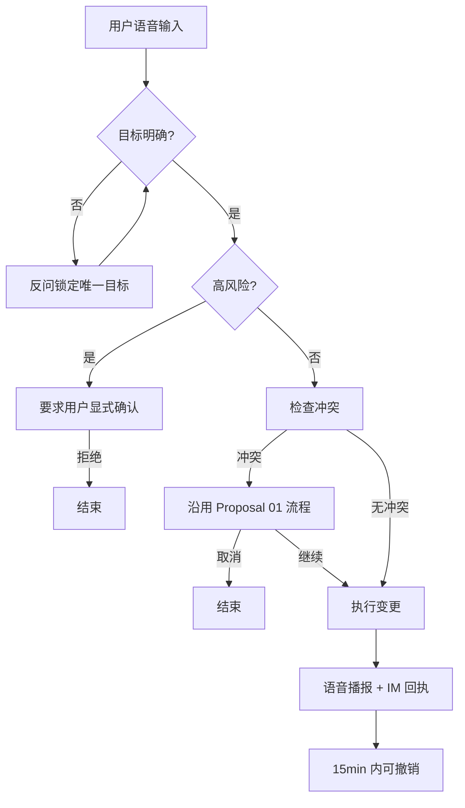

MVP包含三个Proposal，分别如下：

# Proposal 1：语音创建与查询

## 1. 动机 / 用户故事

**动机：**在日常生活中，大家或多或少都有一些琐事，下楼买个牙膏、拿个快递、聚餐位置等等，对很多人来说都是靠脑子记，做的更多一点的就是把这些信息发送到微信“个人传输助手”之类的。

发送到微信上的还好一点，毕竟好记性不如记下来，但是靠脑子记，就很容易忘掉这些小事，比如：你早上发现没牙膏了，你费力挤了一点出来，你说晚上下班记得买，下了班之后，按照往常习惯直接就上楼了，到了第二天早上又发现没有牙膏了，只能再再费点力，然后说下班买，下了班之后又直接上了楼，可能只有偶然到了楼下才记得要买牙膏才会去买，或者专程去买。用微信的其实也有打开微信的成本，并且同样也得记住要买才行。

所以就想着能不能做一款随身携带、随时呼叫、随时提醒的一款设备，或许它能够帮我把“声活”过得更好。

## 2. 目标用户

那些为生活小事而苦恼的人、那些热爱生活的人、那些为了更美好的生活的人。

## 3. 现有做法及其不足
1. 脑子记——大事不用记、小事记不住
2. 微信、记事本、备忘录——可以用，但是是全手动，从记到修改到查找全部靠自己完成。
3. 第三方产品（比如：番茄 TODO 之类的）——也可以用，但是还是有一定的交互成本，和第二点有点等同。

## 4. 本期范围与明确不做

### 4.1 本期做

本期不做多了，完成一个小闭环即可，通过语音输入告诉它帮我记一件事、提醒一件事就好。
1. 记一件事
2. 提醒一件事
3. 查询一件事

**注：**并非只能记一件事和提醒一件事，N 件事也可以。

### 4.2 本期明确不做
1. 第三方平台日历事项同步
2. 复杂的周期性提醒不做
3. 场景化不做——虽然有点意思，但是也有点复杂
4. 第三方平台数据输入到我们平台——虽然有了更多数据可以玩出更多花来，但是对主干来说没有任何影响和语音输入是等价的。
5. 多模态创建——语音这条路走通了，其他模态自然也没什么问题。

## 5. 关键决策与依据

**决策：**更多维度的数据输入到我们平台，视觉、Github等数据是否需要。

**答：**能不能做？能做。重不重要？重要。但不是现在做，我们可以接入更多的数据进来，但它只是支持了更多的场景或者更方便了用户，它和语音输入从某种角度来说没区别，复杂了。

## 6. 基本概念与信息结构

**基本概念：**
1. 记一件事：将这件事存起来，在需要时被提及。
2. 提醒一件事：用户主动说明的时间点提醒，模糊的时间点不提醒。
3. 查询一件事：用户问起来，你得知道有没有这件事。

**信息结构：**

**如果是 APP 做为承载体的话：**
1. 语音输入按钮：长按收音、松开停止收音。
2. 事项列表：可在 APP 中查看已记录的事（区分提醒事件、记录一件事）。
3. 历史对话：可查看历史聊天信息。

**如果硬件作为承载体的话：**
1. 这个硬件能听能说（有头没有身体）。
2. 能够被唤起（非全天候）。

## 7. 原型 / Demo

**APP 文字原型界面：**

**首页页面：**一个语音按钮在底部，上面为历史聊天记录，最顶部“首页”和“事项”选择的 tab 栏。

**事项页面：**展示所有被记录的事项，三个 Tab 选项进行分类（全部、提醒、记录）。

## 8. 验收标准
1. 这不是一个聊天产品，而是专注记录生活的产品。
2. 用户能按住按钮说话，产品有语音反馈。
3. 能实时展示用户语音转换文本的内容，确保语音和转换后的文本语义一致。
4. 将用户需要记录/提醒的事归类展示。
5. 用户能够询问记录的事项（比如：下班要干什么来着）。

# Proposal02-提醒触发与即时响应

## 1. 用户故事及需求

### 1.1 相关用户故事
- 作为一名用户，我希望在日程或提醒事项发生时(前)收到即时语音提醒，以便我能够及时采取行动。
- 作为一名用户，我希望能够选择在提醒触发时推迟进行再提醒，但是不改变原定提醒时间。
- 作为一名用户，我希望在有多个任务或提醒事项同时发生时，App 能够通过语音简明但清晰地告知我同期发生的事项，不重复、遗漏、阻塞。
- 作为一名用户，我希望在提醒触发时，可以通过语音快速响应相关提醒，如“稍后提醒我”、“知道了”、“好的”等，包括直接打断相关提醒，以便我能够快速处理提醒事项，同时不被过度干扰。
- 作为一名用户，我希望在简明提醒触发时，可以通过语言响应来查询对应日程及提醒的详细内容，如“开会的那个日程的位置在哪里？”“会议有哪些参会人？”等，以便我能够快速获取相关信息。
- 作为一名用户，我希望在我对多个提醒事项进行语音响应时，App 能够根据我的语音指令边界清晰且快速地处理我的语音指令，以便我能够高效地管理我的提醒事项。

### 1.2 共同需求
在既定日程及提醒事项的触发条件发生时，用户可以通过语音即时响应，以快速、高效、准确地对排程进行处理。

## 2. 目标用户
- 有日程管理需求的用户
- 手动操作受限的用户
- 希望通过语音被提醒及进行响应的用户

## 3. 现有做法及不足
| 现有做法                     | 不足                                 |
| ---------------------------- | ------------------------------------ |
| GUI提醒                      | 无屏幕设备无法精确提醒               |
| 铃声提醒                     | 无法让用户清晰感知日程               |
| 手动操作响应                 | 在不便于手动操作的场景下难以进行响应 |
| 多日程线程式顺序进行提示     | 不响应前置提醒造成后置提醒阻塞       |
| 根据特定关键词对提醒进行响应 | 用户语义模糊或识别不清晰导致误操作 |

## 4. 本期范围与明确不做
| 本期进行                                     | 本期不做           |
| -------------------------------------------- | ------------------ |
| 日程及提醒事项在满足**开始时间**触发条件时进行及时提醒 | 位置等其他触发条件 |
| 日程及提醒事项在满足**预告时间**触发条件时进行预告 |                    |
| 提醒触发时通过语音可以进行快速响应                   |                    |
| 多个提醒触发时可以根据用户意图对特定目标日程进行响应 |                    |
| 用户模糊语义响应识别                                     | 特殊方言、多语言(即发音、用语习惯与普通话差别极大的语种)响应识别 |
| 用户可以追问日程及提醒事项详情信息                             |                    |
| 用户可以打断语音日程及提醒事项提醒                             |                    |

## 5. 关键决策及依据
| 决策项                                                               | 决策依据                                                                                                                 |
| -------------------------------------------------------------------- | ------------------------------------------------------------------------------------------------------------------------ |
| A. 围绕时间触发条件进行提醒 B. 多触发条件进行提醒                 | **选择 A ** 。时间为日程及提醒事项的基本必要字段，基于位置等特殊触发条件可作为后续功能另起 Proposal                      |
| A. 简略语音播报 B. 详细语音播报                                   | **折中**。保留日程、事项的Title、时间点(段)等必要字段，详情信息可在用户追问的情况下进行补充说明                          |
| A. 语音响应需要唤醒词进行唤醒 B. 语音响应可直接对话进行响应       | **选择 A**。由于需要满足用户可打断语音提醒，若不需要特定唤醒词进行响应会导致意外中断提醒。参考Siri、小爱同学等竞品逻辑。 |
| A. 固定唤醒词 B. 用户可自定义唤醒词                               | **选择 A**。当前阶段仅考虑固定唤醒词，用户自定义唤醒词可以作为后续功能另起 Proposal                                      |
| A. 对于提醒事项，用户可以进行无限期推迟 B. 用户仅能进行有限次推迟 | 如若不支持无限期推迟，在用户无回应有限次后将视为结束提醒，但区别于有GUI的情况，可以显示错过的提醒通知，在无GUI的平台，用户将对错过的提醒没有感知。 |

## 6. 基本概念与信息结构
| 概念     | 定义                     | 备注           |
| -------- | ------------------------ | -------------- |
| 日程     | 有**时间段**的事项       | 区别于提醒事项 |
| 提醒事项 | 仅有**时间点**的事项                                            |                                                       |
| 开始时间 | 日程或提醒事项的开始时间 |                |
| 截止时间 | 日程的截止时间           |                |
| 预告时间 | 日程或提醒事项的预告时间 | 默认为开始时间的前15min，可由用户自定义 |
| 推迟提醒 | 当既定提醒事项 到达对应触发时间条件时，对提醒操作约定进行再提醒 | 区别于更改提醒事项的触发时间条件(对应Proposal3)。       |
|          |                                                                 | 默认推迟时间为 15min ，若用户显式指定则遵循用户意愿。对于有截止时间的日程，推迟提醒时间晚于截止时间，则不可再次被推迟，视为提醒结束。对于没有截止时间的提醒事项，则无推迟限制，可以无限推迟至用户指示知道了，完成提醒结束闭环。 |
| 提醒     | 在日程或提醒事项开始时进行语音+持续铃声提醒。                   | 区别于预告，提醒1min无回应则视为进行推迟提醒。                 |
| 预告     | 日程或提醒事项开始前15min进行短铃声+语音提醒(参考企业微信日程默认提前15min预告)。                    | 可被打断，但区别于提醒，不可被延迟。 |

## 7. 原型
见原型视频。

## 8. 验收标准
- 在日程及提醒事项的开始前，根据预告时间，系统正常触发预告
- 在日程及提醒事项的开始时间到达时，系统正常触发提醒
- 在提醒触发时，用户可以通过语言对日程及提醒事项进行快速响应
- 在用户响应语义模糊时系统能够进行准确操作
  - 若不涉及关键词(如关闭、延迟等[此处‘嗯’等易被误识别的短语气词不作为相关关键词，归为置信度低类目])，则请求用户重复需求
    - 如：包的、明咗啦、Yes、Ok、搜噶。
  - 若与关键词相近相关但置信度不高，则询问用户是否希望进行XX需求
    - 如：识别结果为豪德、笑得拉、嗯、哦。
- 多个同触发时间日程或提醒事项同时触发提醒时，能够让用户明确得知所有日程及提醒事项，确保不累赘但也不遗漏、阻塞。
  - 如：Sys：现在是下午三点。您共有两个排程：分别是**开会日程**和**跳舞提醒事项**。
- 用户可打断语音提醒
  - 如：Sys：现在是下午三点，您... User：*小鹏小鹏*，我知道了。Sys：好的。
- 用户可对特定提醒事项进行追问详情信息
  - 如：Sys：现在是下午三点，您有一个三点到五点的产品会议。User：*小鹏小鹏*，我知道了。会议地点在什么地方呢？Sys：在**阳明M01**。
- 用户可界定操作边界
  - 如：Sys：现在是下午三点。您共有两个排程：分别是**开会日程**和**跳舞提醒事项**。User：*小鹏小鹏*，我知道了，一个小时后再提醒我跳舞吧。 -> 结束开会日程的提醒，延迟跳舞提醒事项的提醒。
- 用户可正常推迟日程及提醒事项
  - 对于日程，可以在对应时间段内进行推迟，超出时间段无法进行推迟。
  - 对于提醒事项，用户可以进行无限期推迟，直至用户做出结束提醒回应。

# Proposal03: 已有日程变更与周期控制

## 动机 / 用户故事

| 场景 | 描述 | 痛点 |
| --- | --- | --- |
| 场景1：临时调整单次日程 | 我每天的日程都是17:30写日报，但是今天我要进行路演，需要延迟到19:00 | 手动修改一次提醒可能会影响后续提醒，或者需要我自己后续手动改回，很不便利 |
| 场景2：因外部原因变更日程时间 | 我今天本来是10:00开会的，但是会议室坏了需要维修，下午才能修好，故会议推迟到下午，需要修改我的日程 | 我需要打开日程安排，自己手动修改我的日程 |
| 场景3：跳过一次周期事项 | 我每周五都要去跑步，但是这周我有事要忙，不能跑步了，我想要跳过本周事项，但是不修改周期日程 | 我需要手动打开日程安排，本周关闭这个日程，后续再打开 |
| 场景4：删除一次性日程 | 我下周一下午三点有一个一次性会议，现在取消了，想彻底删掉 | 需要手动打开日程应用逐条翻找删除，操作繁琐 |
| 场景5：删除整个周期系列 | 我之前设的“每周一早会”已经不再需要了，想把整个周期事项都删掉 | 不敢直接在应用里点删除，怕误删其他日程或错过确认 |
| 场景6：撤销刚说错的修改 | 我刚说“把周五例会改到周六”，但其实我想说的是另一件事，想反悔 | 改完已经触发 IM 推送，得手动再改回来，麻烦且留痕混乱 |
| 场景7：撤销误删除 | 我刚说“删除下周一的那次会议”，说完就后悔了，想恢复到删除前的状态 | 删除后需要手动重新创建同名日程，容易遗漏参会人与时间信息 |

## 目标用户
- 需要暂时修改或者永久修改自己的日程，并希望能通过语音交互而不是进行繁琐点击交互
- 需要跳过一次日程，但是手动操作繁琐，且容易遗漏
- 改/删之后发现弄错了，想快速反悔而不用手动复原或重新创建的用户

## 现有做法及其不足

| 当前做法                      | 不足           |
| ------------------------- | ------------ |
| 手动变更一次日程后续再自己改回来，或是手动变更修改 | 需要手动变更，缺乏自动化 |
| 手动跳过一次（自己关闹钟）             | 操作繁琐，且容易遗忘   |
| 改/删之后发现弄错了，再手动改回去或重新创建    | 需要记住原始信息，且已触发 IM 推送，留痕混乱；误删后还会丢失参会人、地点等元数据 |

## 本期范围与明确不做

做：
- **修改单次日程**：用户通过语音修改只发生一次的日程（如标题、时间、地点、备注），修改成功后语音播报并发送 IM 回执。
- **跳过日程**：用户通过语音跳过本次日程（单次日程等同取消，周期日程仅影响本次实例），跳过成功后语音播报并发送 IM 回执。
- **修改周期实例（仅本次）**：用户通过语音只修改一个周期实例而不影响后续，修改成功后语音播报并发送 IM 回执。
- **修改周期事项（本次及以后）**：用户通过语音永久修改一项周期事项，修改成功后语音播报并发送 IM 回执。
- **删除日程**：用户通过语音删除单次日程或整个周期系列（高风险操作），删除成功后语音播报并发送 IM 回执。
- **高风险操作确认**：用户进行永久删除周期系列、修改周期事项（本次及以后）等高风险操作前，必须先获得用户显式确认，未确认不执行。
- **歧义消解**：用户修改日程时若命中多个候选，应通过反问锁定唯一目标后再执行。
- **不存在提示**：用户修改一个不存在的日程时，语音提示日程不存在并不执行任何变更。
- **冲突处理遵循 Proposal 01**：修改/跳过/删除日程时，如与已有日程发生时间冲突，沿用 Proposal 01 中定义的冲突检测与用户确认流程，不重复定义行为。
- **撤销**：用户可通过语音撤销最近一次成功的变更（包含修改、跳过、删除），撤销窗口为 15 分钟（按自然时间计算，跨会话也计入），超过窗口的不允许撤销；撤销成功后语音播报并发送 IM 回执。

不做：
- 批量修改或批量跳过多项日程（一次语音只对应一个目标）
- 语音创建新的日程或提醒（属于 Proposal 01）
- 语音对已有提醒表达"知道了"或延迟提醒（属于 Proposal 02）
- 自动为用户选取修改范围（"本次"还是"本次及以后"必须由用户明确指定）
- 冲突的处理（仅复用 Proposal 01 的冲突处理约定）
- 完整的工作日、节假日、调休日等复杂周期规则（仅支持简单"每天/每周/每月"等基础周期）
- 嵌套周期与周期例外（exception）的高级管理（如"每周一三五，但跳过下周—下周三"等组合）
- 跨日历源的日程读取与同步（如 Google/Exchange/飞书日历的拉取与回写）
- 跨时区与夏令时处理（仅以用户当前时区为准）
- 通过语音查询/列出日程（"我今天有什么"不在本期范围）

## 关键决策与依据

用户修改日程时有歧义
- 备选方案 A：询问细节进行确认
- 备选方案 B：命中最匹配的一项

选择 A，理由：需要用户阐明，避免改错

撤销时间窗口
- 备选方案 A：5 分钟（太短，易遗漏）
- 备选方案 B：15 分钟
- 备选方案 C：30 分钟（太长，占用资源、易误撤）

选择 B，理由：平衡“误操作后能否来得及反悔”与“减少长时间状态不一致带来的资源占用与误撤风险”；超出 15 分钟后只能通过手动再修改。

撤销是否覆盖删除
- 备选方案 A：撤销只覆盖修改与跳过（删除不可逆）
- 备选方案 B：撤销覆盖全部成功变更（含删除）

选择 B，理由：删除是高风险但常可补错的操作；不提供撤销会使用户叠加负担重建日程与参会人；高风险另有显式确认环节作为前置防线。

撤销窗口是否跨会话
- 备选方案 A：仅限当前会话，退出/超时后失效
- 备选方案 B：按自然时间计算，跨会话也计入

选择 B，理由：用户误删后可能在其他终端才发现（例如手机上删除、桌面端才看到参会人异议），跨会话不计入会导致“不能反悔”的隐性边界；按自然时间计算更可预测，但需要服务端持久化撤销记录。

## 基本概念与信息结构

### 核心概念

| 概念    | 含义                                      |
| ----- | --------------------------------------- |
| 单次日程  | 只发生一次的日程，例如“今天下午三点开会”                   |
| 周期事项  | 按固定规则重复发生的事项，例如“每周五下午五点提交周报”            |
| 周期实例  | 周期事项中的某一次，例如“本周五这一次周报”                  |
| 高风险操作 | 可能影响后续安排，有一定影响范围等事项                     |
| 本次    | 只改变当前指定的一个周期实例                          |
| 本次及以后 | 从指定实例开始改变后续安排，之前的实例保持不变                 |
| 跳过    | 对周期事项只影响一个实例，下一次仍按原周期继续；对单次事项等同取消，确认后执行 |
| 删除    | 移除指定日程或周期系列，属于高风险操作                     |
| 撤销    | 在 15 分钟内可恢复最近一次变更前的状态（包含修改、跳过、删除），按自然时间计算，跨会话也计入；超出窗口不允许撤销 |

### 变更流程

## 原型 / Demo

Todo

## 验收标准

成功路径：
- 用户语音交互修改一次单次事项时无冲突，完成修改，语音回复修改成功，并发送IM回执
- 用户语音交互修改一个周期实例，而不影响后续时，完成修改，语音回复单次修改成功，并发送IM回执
- 用户语音交互修改一个周期事项，并影响后续时，完成修改，语音回复周期事项修改成功，并发送IM回执
- 用户语音交互删除一个单次日程时，完成删除，语音回复删除成功并发送IM回执
- 用户语音交互删除一个周期系列时，系统先要求用户显式确认；用户确认后完成删除，语音回复删除该系列并发送IM回执；用户未确认则不执行删除
- 用户语音交互跳过一个周期事项时，仅该实例被跳过，后续实例不受影响，语音回复跳过成功并发送IM回执
- 用户语音交互跳过一个单次日程时，等同取消（本次取消后该日程不再生效），语音回复跳过成功并发送IM回执
- 用户语音交互要求撤销之前修改的事项时，完成恢复，语音回复撤销成功并发送IM回执
- 用户语音交互要求撤销之前删除的事项时，完成恢复，语音回复撤销删除成功并发送IM回执
- 用户在 15 分钟内跨会话（例如退出 App 后重进）发起撤销时，仍应成功恢复

异常路径：
- 用户语音交互要求撤销距离上次成功变更超过 15 分钟的操作时，系统拒绝撤销，语音提示超过撤销窗口
- 用户在一次成功变更后连续发起第二次“撤销”时，系统拒绝，语音提示无更多可撤销的变更
- 用户语音交互修改/删除一个不存在的日程时，语音提示日程不存在并不执行任何变更
- 用户通过语音交互修改日程时有歧义，系统应反问锁定唯一目标后再执行；确认为唯一后完成修改，语音回复修改成功并发送IM回执
- 用户语音交互修改一个日程与已有日程冲突时，沿用 Proposal 01 的冲突处理约定；不重复定义行为

