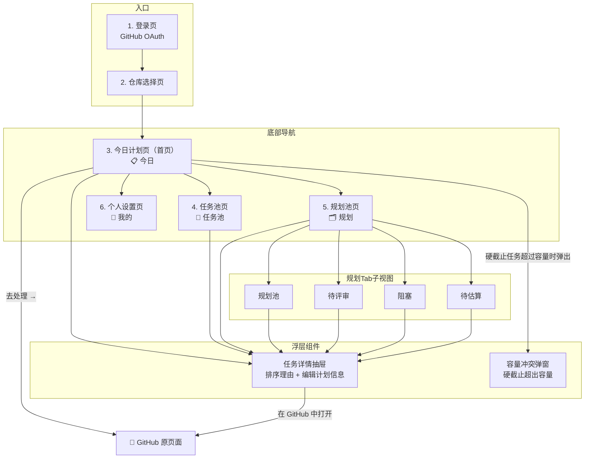
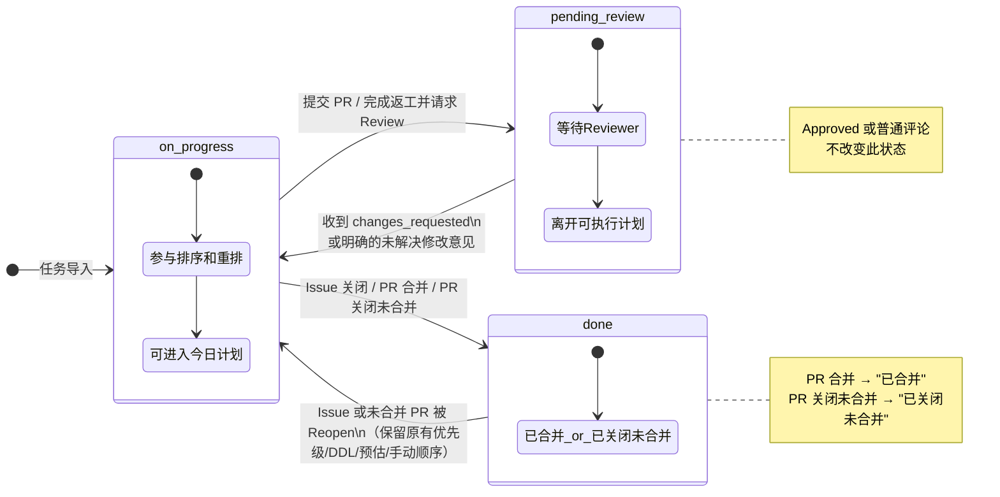
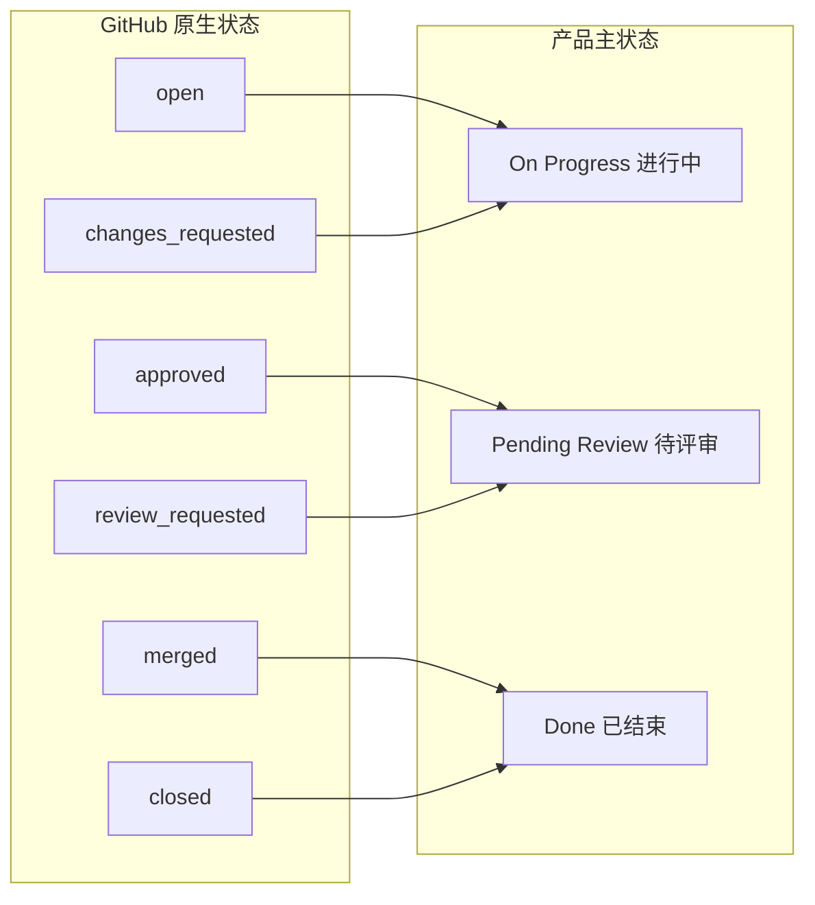
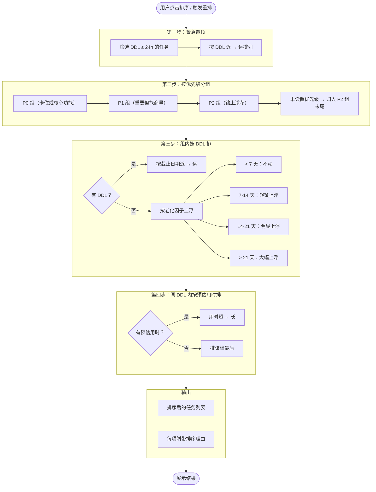
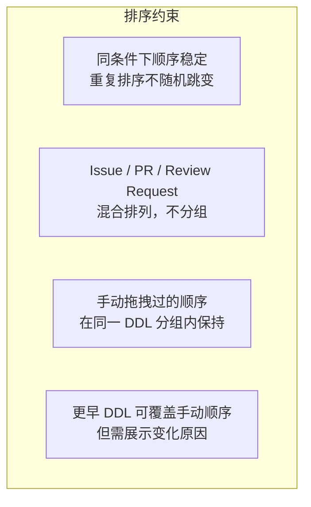
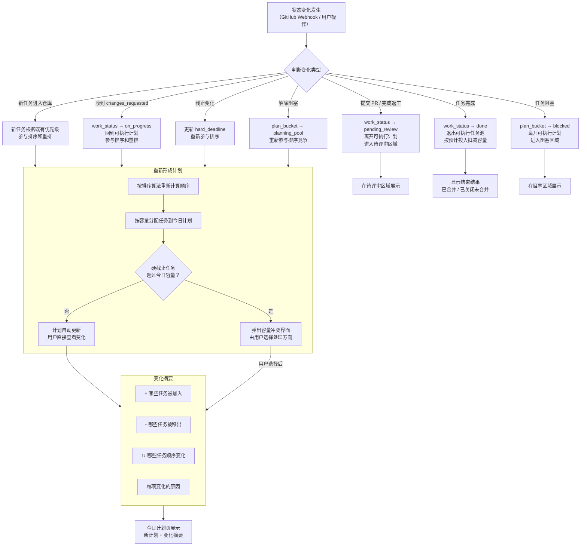
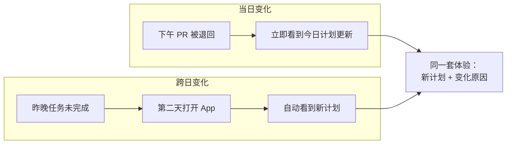
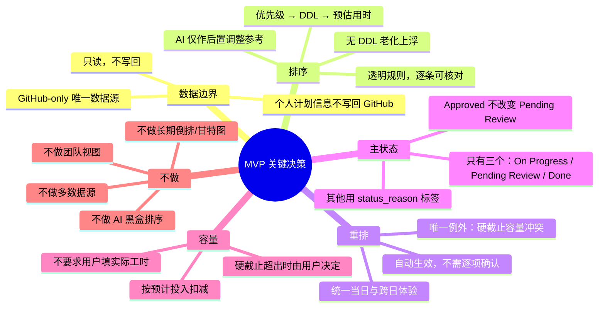

# 产品原型
> 基于：`Proposal 01-任务池导入`、`Proposal 02-优先级排序及展示`、`Proposal 03-任务自动重排`
> 时间：2026-07-14
> 目标：MVP 原型展示，核心逻辑梳理

## Proposal 依赖关系
三个 Proposal 的依赖关系：

```
GitHub Issue / PR / Review Request
        │
        ▼
  Proposal 01：任务池导入 ── 把散落在各处的个人行动收进一个池子
        │
        ▼
  Proposal 02：优先级排序与展示 ── 告诉我今天先做什么，并解释为什么
        │
        ▼
  Proposal 03：任务自动重排 ── 计划失效后，自动给出新的可执行计划
        │
        ▼
  用户确认，回到 GitHub 执行
```

## 数据模型

### 任务对象（从 GitHub 同步）

| 字段 | 类型 | 来源 | 说明 |
|------|------|------|------|
| `id` | string | 系统生成 | 任务唯一标识 |
| `github_type` | `issue` \| `pr` \| `review_request` | GitHub | 区分三种行动类型 |
| `github_number` | number | GitHub | Issue/PR 编号 |
| `github_url` | string | GitHub | 跳转回原页面处理 |
| `title` | string | GitHub | 标题 |
| `repository` | string | GitHub | 所属仓库 full_name |
| `milestone` | string \| null | GitHub | 关联 Milestone 标题 |
| `labels` | string[] | GitHub | 标签列表 |
| `github_status` | `open` \| `closed` \| `merged` | GitHub | GitHub 侧状态 |
| `created_at` | datetime | GitHub | 创建时间 |
| `updated_at` | datetime | GitHub | 最后更新时间 |

### 个人计划信息（用户侧，不写回 GitHub）

| 字段 | 类型 | 来源 | 说明 |
|------|------|------|------|
| `priority` | `P0` \| `P1` \| `P2` \| `unset` | 用户手动设置 | 个人优先级判断 |
| `hard_deadline` | date \| null | 用户设定 / Milestone 推算 | 硬截止日期 |
| `estimated_hours` | number \| null | 用户手动填写 | 预估投入时间 |
| `manual_order` | number \| null | 系统记录 | 用户拖拽后的手动位置 |
| `aging_days` | number | 系统计算 | 自导入或上次更新以来的天数（用于无 DDL 老化上浮） |

### 任务运行态

| 字段 | 类型 | 说明 |
|------|------|------|
| `work_status` | `on_progress` \| `pending_review` \| `done` | **主状态** — 决定是否参与可执行计划 |
| `status_reason` | `changes_requested` \| `blocked` \| `missing_estimate` \| `merged` \| `closed_unmerged` \| null | **状态原因标签** — 解释为什么处于当前状态/位置 |
| `plan_bucket` | `today` \| `planning_pool` \| `pending_review` \| `blocked` \| `unestimated` \| `done` | **计划位置** — 任务在界面中的归属区域 |

### 容量数据

| 字段 | 类型 | 说明 |
|------|------|------|
| `date` | date | 日期 |
| `total_hours` | number | 用户设定的当日可用总时长 |
| `used_hours` | number | 已完成任务的预计投入之和（不要求用户补录实际工时） |
| `remaining_hours` | number | `total_hours - used_hours` |

## 入口总览


## work_status 主状态机



---

**与 GitHub 原生状态的关系**：



## 排序算法流程



---

**排序约束**：



## 自动重排流程



---




## 关键决策

