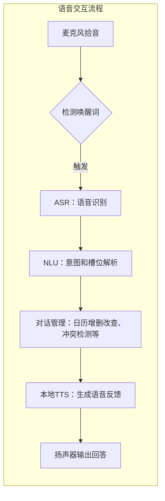

# 执行摘要

本报告针对基于硬件平台的语音日历日程助手进行了全面调研。首先，通过分析用户画像与使用场景，总结了如职场专业人士、家庭用户、学生、老年人、商务出行者等多类典型用户及其应用场景。接着，我们列出了核心功能清单：日程的增删改查、提醒、重复事件、共享日历、冲突检测，以及支持自然语言理解（NLU）、语音唤醒、离线识别、本地 TTS 等关键能力，并对功能优先级进行了评估（见下文功能清单）。然后针对低端（MCU）、中端（ARM）和高端（带AI加速器）三类硬件平台，讨论了CPU/内存、麦克风阵列、扬声器、网络及低功耗模式等对语音日历功能实现的影响。技术方案方面，我们提出了本地/云端/混合部署的选项及其利弊：比如常用的“本地唤醒+云识别”模式和“小米离线包优先、本地兜底”策略等，同时讨论了NLU/ASR/TTS模型的部署、数据同步与冲突解决、离线优先策略以及安全隐私保护措施（如加密存储和最小化数据上云要求等）。在竞品分析中，对比了亚马逊 Alexa、Google Assistant、苹果 Siri、国内小米小爱、阿里天猫精灵、百度小度等6款主流语音助手/智能硬件的日历功能，包括功能覆盖、语音交互流程、离线能力、隐私策略、开放API和可扩展性等差异（见竞品对比表）。此外，我们给出了典型的多轮交互对话示例（创建、修改、删除日程等），并绘制了语音交互处理流程图（从唤醒到ASR→NLU→日历操作→TTS）。最后，报告讨论了性能指标（如响应时延、识别准确率、唤醒误触率、同步冲突率、离线覆盖率等）的测试方法和目标阈值，以及开发风险、合规（GDPR、中国个人信息保护法）、隐私要点和商业模式（硬件捆绑、订阅、高级功能、SaaS API等）。基于以上分析，建议采取云+端混合架构，优先实现基础日程管理功能，并在3/6/12个月内分阶段迭代（MVP见路线图）。整个方案充分考虑了技术实现的可行性、市场需求及法规要求，以期构建一款高效、安全、用户体验友好的硬件语音日历助手。

## 目标用户与使用场景

- **职场专业人士**：如公司管理者、销售代表等，常需快速安排会议、查询会议信息并避免日程冲突。典型场景：在办公环境或出差途中通过语音添加或查询商务会议安排。  
- **家庭用户（家长）**：需要协调家庭成员（如父母、小孩）的日程，例如安排家长会、孩子兴趣班、家庭活动等。通过语音助手提醒一家人当天的安排、设置家庭共享日历、邀请家庭成员参加等。  
- **学生群体**：大学生或中学生，用于管理课程表、作业截止、考试时间等学习任务。例如在宿舍内或走路时通过语音创建课程提醒、查询考试日期或安排复习计划。  
- **老年人或视障人士**：视力不便者通过语音管理日程（如就医提醒、家庭探访等），不需操作触屏即可获知当天安排或加入新提醒，提升便利性。  
- **商务出行者**：经常出差的商务人士在行车或坐飞机时使用车载或移动设备语音助手安排日程。例如通过车机语音助手添加约见、航班行程等，并根据时区自动调整日程。  
- **智能家居/物联网用户**：以智能音箱或可穿戴设备形式出现的语音助手用户，场景包括：晨起询问今日安排、听写待办事项、多用户环境下区分成员（声纹识别）后读取个人日程等。

以上用户场景覆盖家庭、办公室、车内、户外等环境，体现了语音日历助手免提交互和多设备联动的价值。

## 关键功能清单与优先级

- **日程管理基础（高优先）**：支持创建、删除、修改、查询日程事件（增删改查），包括通过自然语言添加事件标题、时间、地点等。需要解析多种时间表达（“明天下午三点”、“下周五全天”等），处理中文日期与时间。
- **提醒与通知**：创建基于时间的提醒或闹钟（一次性或倒计时），并支持事件临近自动播报（语音或本地通知）。
- **重复/周期事件**：支持添加周期性日程（每天、每周、每月、每年）和自定义重复规则。如“每周一下午开会”。
- **共享日历与邀请**：支持多个用户共享日历，邀请联系人参加事件。可与家庭日历或企业日历同步，实现多人协同和日程合并查看。
- **冲突检测**：新增或修改日程时自动检测时间冲突，向用户提示冲突事件，并可询问是否覆盖或修改。例如用户说“周五下午三点添加会议”，若已存在事件，助手需反馈“您已有会议在同一时间，是否调整时间或覆盖？”等。
- **语音交互能力**：
  - **意图理解（NLU）**：支持基于自然语言的意图识别和槽位提取，如解析“后天下午两点开产品会议”中的事件名称、日期、时间。多轮对话补全信息，例如缺失时间时询问具体时段。
  - **唤醒与离线识别**：支持关键词唤醒（如“小爱同学”），结合低功耗的远场唤醒（WakeNet模型）检测；对关键指令进行离线识别（在无网络时仍能添加基本日程或闹钟）。  
  - **语音合成（TTS）**：本地生成自然语音回复，支持多种音色与风格，离线合成提高响应速度并保护隐私。
- **个性化与隐私**：支持多用户场景中的声音识别（声纹区分家庭成员，加载各自偏好）；权限与隐私控制，如用户授权收集日程信息并决定是否存储至云端、可清除语音记录等。  
- **多端同步**：日程数据在云端同步（结合硬件平台的网络能力），实现手机、音箱、车机等跨设备统一日历；支持离线优先策略，断网时本地存储操作，联网后自动同步冲突解决。  

优先级建议：首先实现基础日程增删改查、提醒和多轮语音理解；其次完善重复事件、冲突检测和共享邀请等功能；后续持续优化离线能力、本地TTS与个性化功能。

## 硬件平台约束与能力

- **处理器（CPU/MCU）**：  
  - *低端MCU级*（如ESP32系列）：内存与运算资源受限，仅能运行轻量级的关键词检测和小规模离线识别模型。Espressif的WakeNet模型仅占20KB内存，可在安静环境下实现近场唤醒97%准确率（1米距离）。利用其MultiNet可支持最多100个汉语命令词的离线识别，适合基本语音命令（如设闹钟、开/关灯）。MCU通常搭配低功耗前端（如ESP32-S3）常驻监听唤醒词，唤醒后激活主芯片处理。因此低端硬件可实现基础唤醒和命令，但复杂NLU和大规模语音模型则需云端辅助。  
  - *中端ARM级*（如树莓派、安卓板）：计算能力较强，可运行离线语音识别引擎（例如Vosk、Espnet等），并执行简化版NLU。中端设备可部署轻量TTS和ASR模型，支持更丰富离线交互（天气查询、本地日历等）。例如，一些车载系统利用车载CPU实现本地ASR和TTS以保证驾驶时低延迟响应。  
  - *高端带AI加速器*：配备NPU/AI协处理器的设备（如部分智能音箱或手机SoC），能够在本地加速神经网络推理，可运行较大型的ASR/NLU/TTS模型，实现完全离线的语音对话。高端设备能提升识别准确性和语义理解深度，并减少对云端依赖，同时仍需考虑功耗与成本。  

- **内存与存储**：  
  语音模型（尤其端到端ASR或语义模型）通常占用数MB至百MB空间。低端设备需采用剪枝模型或仅存储关键词集；高端设备可加载更多语言模型和日历数据库缓存以提高离线覆盖。  

- **麦克风阵列**：  
  多麦克风阵列支持波束成形和降噪，可实现远场拾音和声源定位，提高嘈杂环境下的识别率。音箱或车载助手中常见多麦克风设计，以保证远处讲话也能被准确捕捉。

- **扬声器**：  
  音质和输出音量影响TTS反馈的清晰度和体验。高品质扬声器能让助手语音更自然悦耳，必要时可考虑多音色或声纹克隆，以增强亲和力。

- **网络连接**：  
  设备可有WiFi、蓝牙或蜂窝网络等连接方式。在线模式下可实现实时数据同步与云端计算，离线模式下需依赖本地存储与模型。应设计断网情况下的容错策略：依靠本地ASR/语义处理及TTS提供基础日程服务。

- **低功耗模式**：  
  设备在空闲或待机时通常需要低功耗监听唤醒词。结合专业低功耗语音唤醒芯片（如ESP32-S3）可将功耗降至毫安级。设计时要确保长时间待机不耗尽电池，在用户唤醒后快速唤醒主机响应。

- **边缘AI加速器**：  
  配备语音DSP或AI芯片（如寒武纪、瑞芯等边缘AI处理器）可大幅提升端侧语音模型的运算效率。现代边缘芯片功耗仅为通用CPU的15%左右，可运行复杂语音识别与合成模型，提高隐私保护和续航。

总体来说，硬件资源越丰富，本地处理能力和离线覆盖越强。但低端设备仍可通过唤醒-简易命令识别与云端协同的方式，保证在无网络情况下完成核心日程操作。

## 技术方案与架构选项

针对语音日历助手，典型的技术架构包括本地部署、云端部署和混合部署三种模式：

- **本地部署**：所有ASR、NLU、TTS模块均在设备端运行，可最大化隐私保护和低延迟。适用于对隐私敏感或网络不稳定的场景，但受限于算力和模型规模。苹果Siri部分请求即在本机离线处理（如本地ASR和部分简单意图），仅复杂任务才上传云端。类似地，可在设备端部署精简语法或小型语义模型，支持常用指令如“设闹钟”、“添加事件”等本地执行。   

- **云端部署**：ASR/语义/TTS等核心计算由云服务器承担，设备仅负责录音与播放。优点是可调用强大模型（如大型语言模型）实现复杂对话，实时更新和扩展性强；缺点是网络依赖、潜在延迟和隐私担忧（音频须上传）。适合设备资源受限但网络覆盖好的场景，需确保网络延迟控制在合理范围（业内优秀系统端到端延迟一般控制在500ms以内）。

- **混合部署（推荐）**：结合本地和云端优势，灵活分配任务。例如，主流设备往往采用“本地唤醒+云识别”模式：设备常驻低功耗模型监听唤醒词，后续语音则上传云端做识别和高级理解。另一种是**本地优先、云端兜底**：在设备上先尝试执行简单指令（比如查询天气、本地日历记录），若请求超出离线能力再请求云服务。还可进行**组件拆分**：前端音频预处理和ASR可在本地完成，识别结果文本上传云端做NLU和对话管理，最后可选择云端TTS或本地TTS合成。比如很多车载助理在车机上进行本地ASR+TTS（保证驾驶时零延迟），而将复杂语义理解任务交给云端。此种混合架构需设计好在线/离线切换策略，确保用户体验一致（例如在线询问天气返回详细信息，离线则返回“暂无网络”提示）。

**NLU/ASR/TTS 模型部署**：可选用现成开源或商业模型，如基于深度学习的ASR（DeepSpeech、Kaldi、Vosk等）和NLU（Rasa、Snips等），以及TTS（Tacotron、Mimi-V2.5等）。本地版本需要考虑模型量化与精简；云端可使用大型预训练模型（甚至LLM）来处理复杂查询。语义理解重点在解析日期、事件和上下文，建议结合时区、地理等上下文信息提高准确性。

**数据同步与冲突解决**：日程数据多存储在云端（如集成Google/Apple/企业日历），需要支持OAuth授权访问和双向同步。离线时，助手可将新增/修改操作缓存在本地，恢复网络后自动同步：如果发生冲突（如多设备同时修改），系统应提示用户选择保留或合并。例如，当用户同时在手机和助手对同一事件改动时，可询问“您希望保留哪个版本？”或采取最后编辑覆盖策略。合适的冲突率目标应接近零，测试方案可模拟并发修改来验证同步一致性。

**离线优先策略**：对关键功能（如唤醒、基本增删改查、当前日程查询等）预置本地能力，确保断网时仍可提供基础服务。高级功能（如复杂多轮对话、大规模知识查询）则依赖云端。通过本地存储常用语料库（如用户词典、默认回复）和预加载少量语音模型，可显著提升离线识别覆盖率。

**安全与隐私保护**：符合GDPR和中国《个人信息保护法》的要求。具体措施包括：严格的用户授权流程（例如请求访问日历时需用户明确同意，日程数据的上传仅在授权下进行）；数据最小化存储（仅在云端保存必要信息，用于多端同步）；传输与存储加密（HTTPS/SSL加密通道，本地数据库加密）；提供隐私选项（用户可查看/删除历史记录、本地留存语音日志最小化）；匿名化处理语义数据等。若日历涉及敏感信息（会议地点、参与人），需确保这些信息不在无加密条件下泄露。

## 竞品分析

以下对比了6款具有语音日历功能的典型硬件语音助手/智能设备，覆盖国内外语音助手、智能音箱、车载和可穿戴设备（以表格形式呈现）：

| 产品/平台       | 核心日程功能               | 语音交互流程     | 离线能力             | 隐私策略                                      | API/集成能力                  | 可扩展性            |
| -------------- | ------------------------- | -------------- | ------------------ | ------------------------------------------ | -------------------------- | --------------- |
| **Amazon Alexa (Echo)** | 支持添加/删除/修改/查询日程，可关联Google、Exchange等账户；支持提醒、重复事件和家庭共享日历。 | 采用自定义技能和对话流；用户询问→Alexa确认意图→执行操作。 | 唤醒词离线执行（Echo靠Alexa蓝灯，Echo Show等自带本地唤醒），核心日历交互需云端处理；无本地TTS。 | 存储用户语音记录并提供隐私设置（用户可听取并删除语音历史）；可选择不开启“改进服务”选项减少数据留存。 | 支持Alexa Skills套件，可通过Alexa Skills Kit开放平台自定义日程技能；与第三方服务（Google Cal）集成。 | 生态成熟，Alexa技能可大规模扩展；支持多语言和跨平台（手机、音箱、车载）。 |
| **Google Assistant (Nest)** | 与Google日历原生集成，支持语音创建/管理事件、提醒；可以邀请他人、设置重复；日程会显示在所有Google设备上。 | “Assistant”主动对话：用户问→Assistant转发云端NLU→返回答案。可在屏幕设备上显示日历视图。 | 仅本地唤醒；大部分语音识别和NLU均依赖云；具有本地TTS应答，但大多操作需联网。 | Google日历隐私标准：数据加密存储于Google云端；提供隐私仪表板和活动管理，允许删除历史录音。 | 提供Actions on Google平台，可与Google Calendar API直接集成；支持Third-party Actions。 | 平台开放性强，可接入第三方设备；支持多语言；以强大的搜索和ML模型支持扩展功能。 |
| **Apple Siri (HomePod/iPhone/Watch)** | 与Apple日历/iCloud同步。支持语音增删查改事件、提醒和重复事件。CarPlay中也可创建日程。 | 基于iOS/WatchOS “意图”框架：用户发起→Siri本地ASR→NLU（部分本地）→执行日历操作。 | iOS 15+开始部分Siri功能本地离线处理（如设置提醒、发送短信）；本地TTS。 | Siri 默认不保留语音日志供分析（改为本地识别）；用户可关闭“改进Siri与听写”选项；日历数据存储在iCloud并使用加密。 | 不开放日历操作API给第三方；支持Siri捷径，可与应用深度集成。 | 相对封闭，主要在苹果生态内；功能更新依赖iOS系统版本；可扩展性有限。 |
| **小米小爱同学 (智能音箱/手机)** | 支持创建/查询/删除日程、提醒；支持周期事件和家庭共享日历；可跨设备查询（手机与音箱互联）。 | “小爱”主动或被动问答：用户唤醒→本地离线触发→ASR/NLU分析→执行日历命令。 | 提供离线包可处理基础指令（设置闹钟、打电话等），但日程类一般需调用云服务；部分TTS本地合成。 | 通过小米账号同步日程。隐私策略中明确需用户授权上传日程至小米云；语音数据默认上传分析，可关闭“连续对话优化”以减少上传。 | 提供小爱开放平台，可开发Skill；可与米家智能家居联动，但日程接口仅限官方。 | 深度绑定小米生态，与米家设备联动强；支持声纹识别区分用户；可扩展性依赖小米平台策略。 |
| **阿里天猫精灵 (智能音箱)** | 支持管理日历和提醒；可关联阿里云邮箱/第三方账户；支持重复提醒和家庭共享（家庭号可以共享日历）。 | 基于AliGenie平台：用户语音→AliGenie处理→返回日历操作结果。 | 支持关键词本地唤醒，基础查询可通过本地TTS；日历交互需云端识别。 | 默认语音记录用于系统改进，可在App中查看/删除；日程数据保存在阿里云端。 | AliGenie开发者平台支持创建生活技能，部分合作日历服务可接入，但整体封闭性较高。 | 在中国市场具有较多生活场景集成（淘宝、天猫等）；可与其它阿里生态产品配合使用。 |
| **百度小度 (小度音箱/车载)** | 支持日程增删改查、提醒；可接入百度账号或第三方日历；支持天气、交通等场景联动查询。 | 典型DuerOS对话：用户唤醒“小度小度”→云端NLP处理→执行日程查询或管理。 | 支持本地唤醒，高端设备如小度在家可以本地处理部分常用指令；日历相关操作依赖云识别与TTS。 | 百度会话数据用于优化服务；用户可在小度App中查看/删除语音记录；日程数据存储在百度云端并加密。 | 提供DuerOS语音开放平台，可定制技能，目前与第三方日历集成有限。 | 语音能力强，兼容多设备（音箱、电视、车载）；对中文普通话识别率高；可扩展的国产平台。 |

上述竞品对比可见，各平台在日历功能上均支持基本的增删改查和提醒设置，差异主要在离线能力和开放程度。国际大厂（Alexa/Google）开放性强，生态广泛，云端处理能力强；苹果注重本地隐私；国产小爱、天猫、小度等紧密结合本地生态，支持中文语义理解，但依赖云服务和平台政策。竞品分析显示：本地离线处理能力普遍有限（主要限于唤醒和部分命令），多使用云端识别；语音交互流程大致相似（唤醒→ASR→NLU→执行→TTS）。在隐私方面，各家都强调用户数据安全，并提供不同程度的用户控制。

  

## 交互设计与对话流程示例

下面给出常见任务的中文语音对话示例，含意图、槽位及多轮交互。**意图(槽位)：示例用户说法 – 系统应答**。

- **创建日程 (Intent: CreateEvent)**：槽位包括事件名称、日期、时间、参与人（可选）、地点（可选）。  
  示例：  
  用户：“小爱同学，帮我**后天上午10点**安排**产品会议**。”  
  系统：“好的，已为您创建事件‘产品会议’，时间后天上午10:00。”  
  （多轮补充示例：）  
  用户：“小爱同学，我明天下午有空吗？”  
  系统：“明天下午您已有一个会议，是否需要查看或修改？”  

- **修改日程 (Intent: ModifyEvent)**：槽位包括目标事件（可选通过名称或时间定位）、新日期/时间、内容等。  
  示例：  
  用户：“小爱同学，把下周一的**团队会议**改到下午3点。”  
  系统：“已把‘团队会议’的时间修改为下周一下午15:00。”  
  （多轮：若未指定事件，可反问。）  
  用户：“修改会议时间。”  
  系统：“请问您要修改哪一个日程事件？”  
  用户：“把‘产品讨论’改到明天9点。”  
  系统：“好的，‘产品讨论’已改为明天上午9点。”  

- **删除日程 (Intent: DeleteEvent)**：槽位为事件名称或时间范围。确认询问通常需要。  
  示例：  
  用户：“小爱同学，删除我周五的‘客户拜访’日程。”  
  系统：“好的，已删除周五上午的‘客户拜访’日程。”  
  （异常处理：如无该事件。）  
  用户：“删除今天下午的日程。”  
  系统：“您今天下午有以下事件：‘财务会议’、‘回家接小孩’。请问您要删除哪一个？”  

- **查询日程 (Intent: QueryEvent)**：可查询具体日期、下一事件、某段时间安排等。  
  示例：  
  用户：“小爱同学，我明天有什么安排？”  
  系统：“您明天上午10点有‘项目汇报’，下午3点有‘健康检查’。”  
  （多轮：用户继续问详情。）  
  用户：“明天下午3点的是什么？”  
  系统：“明天下午3点是您的健康检查。”  

- **设定提醒 (Intent: SetReminder)**：槽位为提醒内容、提醒时间或提前量。可与事件绑定或独立。  
  示例：  
  用户：“小爱同学，提醒我明天早上8点吃药。”  
  系统：“已为您设置提醒：明天8:00‘吃药’。”  
  （与日程结合示例）  
  用户：“下周二9点有会议，提醒我提前10分钟。”  
  系统：“好的，下周二8:50提醒您参加会议。”  

- **处理冲突 (Intent: ConflictResolution)**：当添加日程冲突时启动此流程。  
  示例：  
  用户：“小爱同学，明天下午两点安排会议。”（已有事件冲突）  
  系统：“您明天下午2点已有一个会议‘团队讨论’，请问要与之冲突覆盖还是换个时间？”  
  用户：“换到下午3点吧。”  
  系统：“好的，会议已安排在明天下午3点。”  

- **共享/邀请 (Intent: ShareEvent)**：槽位包括事件、联系人或角色。  
  示例：  
  用户：“小爱同学，邀请**李雷**参加明天10点的‘项目汇报’。”  
  系统：“已向李雷发送邀请，提醒他‘项目汇报’活动。”  

以上模板可根据实际业务需求拓展，每个意图需设计相应的多轮确认和异常处理逻辑，以提升鲁棒性和用户体验。

## 性能指标与测试方案

- **响应时延**：测量从用户语音结束到系统开始响应的时间。目标：本地（离线）响应延迟<500ms，云端全流程<1–1.5s。测试方法：模拟多个网络环境（良好/差）并统计平均延迟与置信区间。  
- **识别准确率**：评估ASR转文本和NLU意图识别的准确率。目标：ASR字错误率（WER）低于5%；NLU意图识别准确率>95%。测试方法：构建覆盖不同场景和口音的中文语音测试集，计算WER和意图召回率。注意现场噪声和方言对识别的影响。已有研究显示，当识别率低于88%时用户可能中断交互，应避免错误率过高。  
- **唤醒词检测**：评估系统误触率（False Acceptance Rate）和漏唤率（False Rejection Rate）。目标：近场漏唤率<2%，误唤频率极低（每小时<1次）。测试方法：在安静与噪音环境下播放唤醒词及其他语音，统计系统误触与漏触次数，参考ESP32 WakeNet达到1m 97%唤醒率。  
- **并发同步冲突率**：当多端同时修改日程时成功处理冲突的比例。目标：接近100%。测试方法：模拟多设备并发对同一日程的操作，检查最终一致性和用户提示。理想情况下应自动合并或正确提示用户。  
- **离线识别覆盖率**：在无网络环境下，系统可正确处理的指令占总指令的比例。目标：核心指令（添加/查询基础日程、设置闹钟等）覆盖率>80%。测试方法：准备离线模式常用指令集，检测实际识别及响应的成功率。  

- **其他指标**：如多轮对话成功率、系统吞吐量（并发用户量）等。建议用户体验测试：评估对话自然度和用户满意度。

## 开发与集成风险、合规与隐私要点

- **技术风险**：多模态语音系统集成复杂，需要保证各模块兼容和稳定（例如不同芯片平台的优化差异）。本地与云服务切换需要严格测试以免产生“半离线”模糊体验。开发时还需注意连续对话（Context Carry）和用户打断的处理。  
- **数据合规**：产品主要面向中国市场，需严格遵守《中华人民共和国个人信息保护法》（PIPL），同时考虑GDPR等国际法规要求。应提供清晰的隐私说明和用户同意流程，如上文小爱助手隐私条款所示，用户须授权日程数据存储与同步至云端。例如，应明确告知用户日程信息将上传云端以实现设备间同步，并允许用户关闭同步功能。  
- **数据本地化**：如果为中国境内用户，日程等个人信息最好存储在中国境内服务器（符合PIPL本地化要求）。若支持跨境功能（如与Google Calendar互联），需提供合规的跨境数据保护方案。  
- **授权与权限控制**：操作手机或账户资源时（例如访问系统日历或通讯录），必须通过操作系统授权界面获取用户同意。所有敏感权限（麦克风、日历、位置等）都应按最小必要原则申请。  
- **日志与审计**：系统运行日志需包含错误和关键操作（例如日程添加/删除），以便审计和问题追踪。但日志应匿名化或加密存储，并限制查看权限。用户最好能够查看自己的操作日志并删除记录，以满足“被遗忘权”。  

## 商业模式与变现路径

- **硬件捆绑销售**：将语音日历助手功能作为智能音箱、可穿戴设备、车载系统的标配功能，通过硬件销售获利。可与品牌机型捆绑，扩大市场渗透。  
- **增值订阅**：基础功能免费，提供高级功能订阅，如更高质量的语音合成（多种拟人音色）、云端多语言同步、更大规模的日程智能分析（自动生成会议摘要、自动安排等）。用户按月/年订阅获取额外服务。  
- **企业版/专业版**：针对企业用户提供定制化日程助手服务，如与企业内部日历系统（Outlook、Exchange等）集成、定制对接企业会议平台和工作流，按企业规模收费。也可作为SaaS接口对外提供日程语音服务，企业开发者付费调用。  
- **SaaS API**：开放日程语音处理能力的API，让第三方App或硬件使用。开发者按调用量付费，类似云服务模式。  
- **生态服务与广告**：通过设备生态提供其他增值服务，如关联会议室预订、交通票务查询等。需要注意符合隐私政策，不可滥用日程数据进行推送广告。  

## 实施路线图与里程碑

- **MVP (1–3个月)**：实现基础语音交互框架和日程CRUD功能。模块包括：本地/云端语音识别、核心意图解析和日程数据库（本地缓存+云同步）。支持语音增删查改日程、设置简单提醒。完成基本唤醒词检测和语音合成回复，具备端云混合模式：在线识别调用云服务，离线仅能唤醒和提供提示。  
- **3–6个月迭代**：完善多轮对话流程和冲突检测功能，添加重复事件、共享日历、参与人邀请等进阶功能。优化离线识别包，扩大支持常用指令集；引入本地TTS以降低网络依赖。完成多用户声纹识别与个性化设置，实现常用场景词槽精准解析。进行初步用户测试并根据反馈改进对话体验和准确性。  
- **6–12个月迭代**：增加更多高级功能，如智能日程建议（基于用户习惯智能推荐时间）、行程自动整理、第三方服务集成（天气、交通等上下文信息）。完善日志与安全审计模块，确保符合PIPL/GDPR。优化性能指标：将ASR/NLU准确率提升至95%以上，唤醒延迟缩短。逐步开放第三方API接口，支持技能扩展。  
- **长远规划**：基于市场需求和技术发展，可引入更强的对话模型（如端侧小型LLM）及多模态输入（手势、视觉）。拓展国际市场需适配多语言和合规标准。

整个实施过程中，要保持跨团队协作（语音技术、后端、硬件、产品、合规等），并定期根据用户反馈和测试结果更新优先级。在每阶段结束时检验关键指标（功能完整度、识别率、延迟、安全合规等），确保项目按计划推进并达到质量要求。

