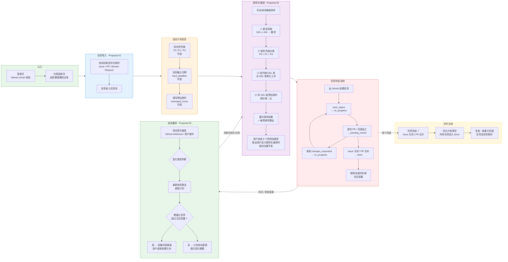

```mermaid
flowchart LR
    subgraph E["入口"]
        direction LR
        E1["登录页<br/>GitHub OAuth 授权"]
        E2["仓库选择页<br/>选择要管理的仓库"]
        E1 --> E2
    end

    subgraph I["任务导入 · Proposal 01"]
        direction TB
        I1["自动拉取选中仓库的<br/>Issue / PR / Review Request"]
        I2["任务进入任务池"]
        I1 --> I2
    end

    subgraph S["设定计划信息"]
        direction TB
        S1["设定优先级<br/>P0 / P1 / P2<br/>可选"]
        S2["设定截止日期<br/>hard_deadline<br/>可选"]
        S3["填写预估用时<br/>estimated_hours"<br/>可选]
        S1 --> S2 --> S3
    end

    subgraph P["排序与规划 · Proposal 02"]
        direction TB
        P1["手动/自动触发排序"]
        P2["① 紧急兜底<br/>DDL ≤ 24h → 置顶"]
        P3["② 按优先级分组<br/>P0 > P1 > P2"]
        P4["③ 组内按 DDL 排<br/>无 DDL 按老化上浮"]
        P5["④ 同 DDL 按预估用时<br/>用时短→长"]
        P6["展示排序结果<br/>+ 每项排序理由"]
        P7["用户自定义个别项目顺序<br/>保证用户定义顺序在重排时相对位置不变"]
        P1 --> P2 --> P3 --> P4 --> P5 --> P6 --> P7
    end

    subgraph E2G["任务状态流转"]
        direction TB
        X1["去 GitHub 处理任务"]
        X2["work_status<br/>→ on_progress"]
        X3["提交 PR / 完成返工<br/>→ pending_review"]
        X4["收到 changes_requested<br/>→ on_progress"]
        X5["Issue 关闭 / PR 合并<br/>→ done"]
        X6["按预估用时扣减<br/>当日容量"]
        X1 --> X2 --> X3
        X3 --> X4
        X3 --> X5
        X4 --> X2
        X5 --> X6
    end

    subgraph A["自动重排 · Proposal 03"]
        direction TB
        A1["状态变化触发<br/>GitHub Webhook / 用户操作"]
        A2{"变化类型判断"}
        A3["重新排序算法<br/>更新计划"]
        A4{"硬截止任务<br/>超过当日容量？"}
        A5["是 → 容量冲突弹窗<br/>用户选择处理方向"]
        A6["否 → 计划自动更新<br/>展示变化摘要"]
        A1 --> A2 --> A3 --> A4
        A4 --> A5
        A4 --> A6
    end

    subgraph G["目标达成"]
        G1["任务完成 ✓<br/>Issue 关闭 | PR 合并"]
        G2["当日计划清空<br/>所有任务进入 done"]
        G3["复盘：查看已完成<br/>任务及实际耗时"]
    end

    E --> I
    I --> S
    S --> P
    P --> E2G
    E2G -->|"次日 / 状态变更"| A
    A -->|"回到可执行计划"| P
    E2G -->|"逐个完成"| G1
    G1 --> G2 --> G3

    style E fill:#e8f5e9,stroke:#43a047
    style I fill:#e3f2fd,stroke:#1e88e5
    style S fill:#fff3e0,stroke:#fb8c00
    style P fill:#f3e5f5,stroke:#8e24aa
    style E2G fill:#ffebee,stroke:#e53935
    style A fill:#e8f5e9,stroke:#43a047
    style G fill:#fff8e1,stroke:#fdd835
```